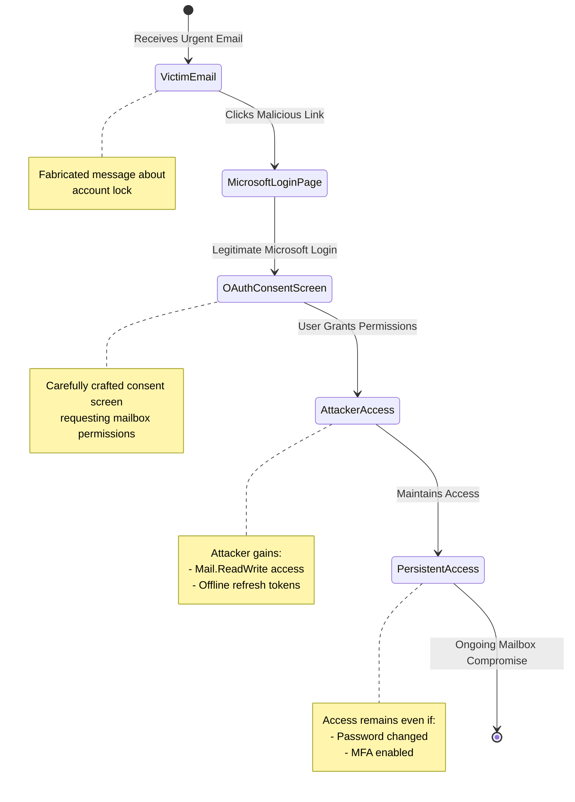

## TL;DR

Last week, while investigating some suspicious Microsoft Outlook activity for a client, I stumbled upon something that made my heart sink. What started as a routine incident response engagement turned into the discovery of one of the most sophisticated OAuth phishing campaigns I've seen in my experience so far of security research.

Here's the kicker - this attack doesn't steal your password. It doesn't care about your MFA. Instead, it tricks you into granting a malicious application complete access to your mailbox, and it does it so smoothly that most users won't think twice before clicking "Accept."

Let me walk you through what I found.

## The Attack That Keeps Me Up at Night

It started with a suspicious OAuth consent screen that one of our clients' employees reported. At first glance, it looked like any other Microsoft application requesting access - clean interface, professional design, all the hallmarks of legitimacy. But something felt off.


I got zero detection over Virustotal which made me excited in the first place.

Digging into the HTTP traffic, I found the initial redirect chain:

```
http://nqvntxrfe6yx.deusgolf.com/account-lock-with-token/?em=[redacted]
```

Now, if you're in security, alarm bells should be ringing. That subdomain is clearly generated programmatically - a technique we often see in malware campaigns to evade detection. But what caught my attention was where it led.

The attackers had set up an intricate infrastructure that leveraged Microsoft's own OAuth endpoints. They weren't trying to steal credentials - they were after something far more valuable: persistent mailbox access through OAuth permissions.

## Down the Rabbit Hole


The more I dug, the more impressed and concerned too I became. The attack flow is brilliant in its simplicity:

1. The victim receives an urgent email about their account being locked
2. Clicking the link takes them through a legitimate Microsoft login flow
3. They're presented with a consent screen requesting mailbox permissions
4. Once granted, the attacker has persistent access - even if the victim changes their password

But here's where it gets really interesting. Looking at the OAuth permission request:


```json
{
  "requested_permissions": [
    "User.Read",
    "offline_access",
    "Mail.ReadWrite"
  ]
}
```

See that `offline_access` scope? That's the real danger here. It allows the attacker to obtain refresh tokens that don't expire. Even if the victim realizes something's wrong and changes their password, the attacker retains access until those OAuth permissions are explicitly revoked.

## Flow of the attack



## The Infrastructure

The attackers weren't amateurs. Their infrastructure showed careful planning:

The callback domain - `c.oinbase.top` - is a clever piece of typosquatting. Notice the missing 'c' in what should be 'coinbase'? In a consent screen URL, that's easy to miss. The single-character subdomain further minimizes suspicion.


They also implemented sophisticated browser fingerprinting. Here's a snippet of what they collect:


```javascript
{
  "deviceMemory": 8,
  "hardwareConcurrency": 12,
  "timezone": "Asia/Calcutta",
  "userAgent": "Mozilla/5.0 (Windows NT 10.0; Win64; x64) AppleWebKit/537.36 (KHTML, like Gecko) Chrome/130.0.6723.70 Safari/537.36",
  "platform": "Win32",
  "language": "en-US",
  "languages": ["en-US"],
  "cookiesEnabled": true,
  "extensions": "No extensions detected",
  "screen": {
    "width": 1920,
    "height": 1080,
    "availWidth": 1920,
    "availHeight": 1032,
    "colorDepth": 24,
    "pixelDepth": 24
  },
  "window": {
    "innerWidth": 1044,
    "innerHeight": 944,
    "outerWidth": 0,
    "outerHeight": 0
  },
  "timezoneOffset": -330,
  "maxTouchPoints": 0,
  "referrer": "https://account.live.com/",
  "battery": null,
  "mediaDevices": null,
  "permissions": {},
  "plugins": [
    "PDF Viewer",
    "Chrome PDF Viewer", 
    "Chromium PDF Viewer",
    "Microsoft Edge PDF Viewer",
    "WebKit built-in PDF"
  ],
  "mimeTypes": [
    "application/pdf",
    "text/pdf"
  ]
}
```

This isn't just for show - it's actively used to detect and evade security sandboxes and automated analysis tools. If the fingerprint doesn't match their target profile, the attack simply doesn't trigger.

## Why This Keeps Me Awake at Night

From the beginning of Jan 2024, I've seen countless phishing campaigns. But this one's different. Here's why:

1. It completely bypasses MFA - because you're logging into a legitimate Microsoft page from your regular browser.
2. Password changes don't help - the OAuth tokens persist
3. It's nearly impossible to detect with traditional security tools
4. Most organizations aren't monitoring for suspicious OAuth grants

The worst part? This campaign is still active, and it's evolving. We've seen the attackers rotate through different domains and adjust their tactics to evade detection.

## Protecting Your Organization

So what can you do? Here's what I recommend:

1. Implement strict OAuth governance. Microsoft 365 lets you restrict which applications can request OAuth permissions. Use it. Here's a PowerShell script to help you audit your current OAuth grants:

```powershell
Connect-AzureAD
Get-AzureADServicePrincipal -All $true | 
Where-Object {$_.AppId -eq "7a420f30-3dbf-4023-898f-f61bcb8cf6c5"} |
Select DisplayName, AppId, PublisherName
```

2. Monitor for suspicious OAuth activities. Look for:
- New application consent grants, especially those requesting mail access
- Applications with unusual redirect URIs
- Multiple consent grants from the same application in a short time period

3. Apply the following Sigma Rule:
```yaml
   title: Suspicious OAuth App Consent
   description: Detects suspicious OAuth consent grants
   status: experimental
   author: Senior Security Researcher
   logsource:
     product: azure
     service: auditlogs
   detection:
     selection:
       eventType: 'Add OAuth2PermissionGrant'
       permissions: 
         - 'Mail.ReadWrite'
         - 'offline_access'
     condition: selection
   falsepositives:
     - Legitimate mail migration tools
     - Approved third-party email clients
   level: high
```

Finally, train your users. They need to understand that permissions matter just as much as passwords. A legitimate Microsoft application shouldn't be asking for mailbox access unless there's a clear business need.

## IOCs

For the blue teamers out there, here are the key indicators we've observed:

- Domain: nqvntxrfe6yx.deusgolf.com
- OAuth callback: c.oinbase.top
- Client ID: 7a420f30-3dbf-4023-898f-f61bcb8cf6c5

## Final Thoughts

This campaign represents a significant evolution in phishing tactics. It's sophisticated, effective, and unfortunately, likely to be widely copied. The days of simple credential phishing are giving way to more sophisticated OAuth-based attacks.

I'll update this post as we discover more about this campaign. In the meantime, check your OAuth permissions, implement proper monitoring, and stay safe out there.


> [!CAUTION] The post above reflects my personal perspective, which is based on the analysis shared in my iZOOlogic Threat Advisory titled [OAuth Exploited: Silent Takeover of Microsoft Outlook Accounts](https://izoologic.com/threat-advisory/oauth-exploited-silent-takeover-of-microsoft-outlook-accounts/).

